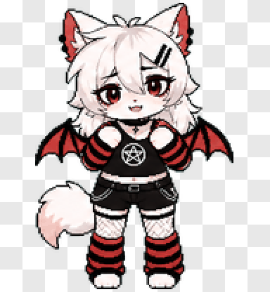
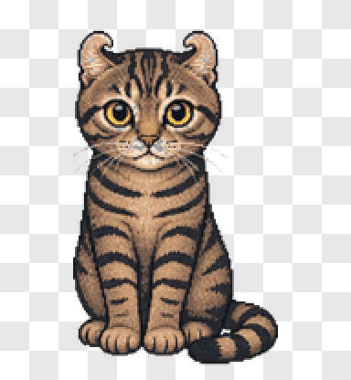
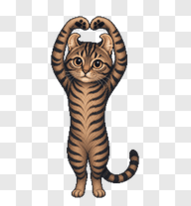
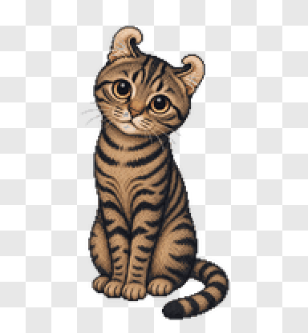
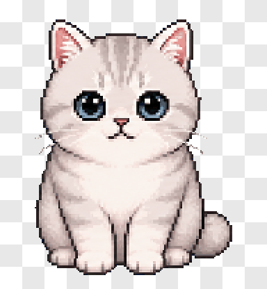
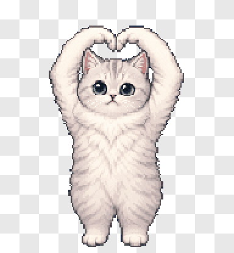
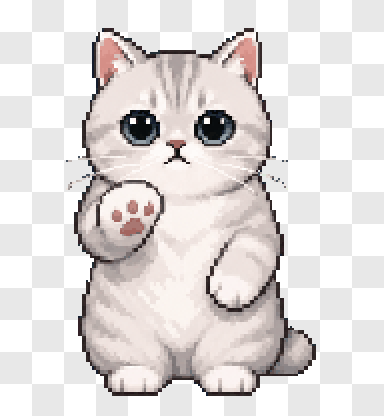

<div align="center">

# Awesome Codex Pet

[简体中文](./docs/zh-CN/README.md) | English

      [](https://github.com/legeling/awesome-codex-pet/actions/workflows/pet-previews.yml)

[**🌐 Live gallery**](https://awesome-codex-pet.pages.dev) · [**⚡ Install guide**](https://awesome-codex-pet.pages.dev/install) · [**📖 Submit a pet**](https://awesome-codex-pet.pages.dev/guide)


</div>

A curated gallery of community-made Codex pets. Browse animations on the [website](https://awesome-codex-pet.pages.dev), install with one command, and submit your own pet through GitHub.

## Highlights

- **One-command install** — no clone, no manual setup, works on macOS / Linux / Windows
- **Live gallery** — animated previews, filtering, and view/install counters at [awesome-codex-pet.pages.dev](https://awesome-codex-pet.pages.dev)
- **GitHub-native submissions** — open an issue or PR, the rest is automated
- **Open licensing** — code under MIT, pet assets under CC BY-NC 4.0

Each pet is a small shareable package:

```text
pets/<pet-slug>--<author-slug>/
├── submission.json
├── pet.json
└── spritesheet.webp
```

Preview images are generated into `assets/previews/<pet-id>/`, never inside the pet folder.

## Quick Install

No clone required. Pick the script for your shell:

```bash
# macOS / Linux
curl -fsSL https://raw.githubusercontent.com/legeling/awesome-codex-pet/main/scripts/install-pet.sh | bash -s -- firefly--lingxiaotian
```

```powershell
# Windows PowerShell
powershell -NoProfile -ExecutionPolicy Bypass -Command "iwr -UseB https://raw.githubusercontent.com/legeling/awesome-codex-pet/main/scripts/install-pet.ps1 | iex; Install-CodexPet firefly--lingxiaotian"
```

```bash
# Anywhere with Node.js
npx awesome-codex-pet firefly--lingxiaotian
```

List available pets:

```bash
curl -fsSL https://raw.githubusercontent.com/legeling/awesome-codex-pet/main/scripts/install-pet.sh | bash -s -- --list
```

Default install locations:

- macOS / Linux: `~/.codex/pets/<pet-id>/`
- Windows: `%USERPROFILE%\.codex\pets\<pet-id>\`

Set `CODEX_HOME` to override, or `AWESOME_CODEX_PET_NO_STATS=1` to opt out of anonymous install counters.

## Pets

### Anime Characters

<table>
<tr><th>Name</th><td colspan="5"><a href="./pets/firefly--lingxiaotian">Firefly</a> · by <a href="https://github.com/legeling">@legeling</a> · Anime Characters</td></tr>
<tr><th>Install</th><td colspan="5"><code>curl -fsSL https://raw.githubusercontent.com/legeling/awesome-codex-pet/main/scripts/install-pet.sh | bash -s -- firefly--lingxiaotian</code></td></tr>
<tr><th>Action</th><td><strong>Idle</strong></td><td><strong>Waving</strong></td><td><strong>Running</strong></td><td><strong>Waiting</strong></td><td><strong>Review</strong></td></tr>
<tr><th>Preview</th><td></td><td></td><td></td><td></td><td></td></tr>
</table>

<table>
<tr><th>Name</th><td colspan="5"><a href="./pets/doro--lingxiaotian">Doro</a> · by <a href="https://github.com/legeling">@legeling</a> · Anime Characters</td></tr>
<tr><th>Install</th><td colspan="5"><code>curl -fsSL https://raw.githubusercontent.com/legeling/awesome-codex-pet/main/scripts/install-pet.sh | bash -s -- doro--lingxiaotian</code></td></tr>
<tr><th>Action</th><td><strong>Idle</strong></td><td><strong>Waving</strong></td><td><strong>Running</strong></td><td><strong>Waiting</strong></td><td><strong>Review</strong></td></tr>
<tr><th>Preview</th><td></td><td></td><td></td><td></td><td></td></tr>
</table>

<table>
<tr><th>Name</th><td colspan="5"><a href="./pets/frieren--lingxiaotian">Frieren</a> · by <a href="https://github.com/legeling">@legeling</a> · Anime Characters</td></tr>
<tr><th>Install</th><td colspan="5"><code>curl -fsSL https://raw.githubusercontent.com/legeling/awesome-codex-pet/main/scripts/install-pet.sh | bash -s -- frieren--lingxiaotian</code></td></tr>
<tr><th>Action</th><td><strong>Idle</strong></td><td><strong>Waving</strong></td><td><strong>Running</strong></td><td><strong>Waiting</strong></td><td><strong>Review</strong></td></tr>
<tr><th>Preview</th><td></td><td></td><td></td><td></td><td></td></tr>
</table>

<table>
<tr><th>Name</th><td colspan="5"><a href="./pets/mahiro--lingxiaotian">Mahiro</a> · by <a href="https://github.com/legeling">@legeling</a> · Anime Characters</td></tr>
<tr><th>Install</th><td colspan="5"><code>curl -fsSL https://raw.githubusercontent.com/legeling/awesome-codex-pet/main/scripts/install-pet.sh | bash -s -- mahiro--lingxiaotian</code></td></tr>
<tr><th>Action</th><td><strong>Idle</strong></td><td><strong>Waving</strong></td><td><strong>Running</strong></td><td><strong>Waiting</strong></td><td><strong>Review</strong></td></tr>
<tr><th>Preview</th><td></td><td></td><td></td><td></td><td></td></tr>
</table>

<table>
<tr><th>Name</th><td colspan="5"><a href="./pets/mikoto--lingxiaotian">Mikoto</a> · by <a href="https://github.com/legeling">@legeling</a> · Anime Characters</td></tr>
<tr><th>Install</th><td colspan="5"><code>curl -fsSL https://raw.githubusercontent.com/legeling/awesome-codex-pet/main/scripts/install-pet.sh | bash -s -- mikoto--lingxiaotian</code></td></tr>
<tr><th>Action</th><td><strong>Idle</strong></td><td><strong>Waving</strong></td><td><strong>Running</strong></td><td><strong>Waiting</strong></td><td><strong>Review</strong></td></tr>
<tr><th>Preview</th><td></td><td></td><td></td><td></td><td></td></tr>
</table>

<table>
<tr><th>Name</th><td colspan="5"><a href="./pets/miku--lingxiaotian">Miku</a> · by <a href="https://github.com/legeling">@legeling</a> · Anime Characters</td></tr>
<tr><th>Install</th><td colspan="5"><code>curl -fsSL https://raw.githubusercontent.com/legeling/awesome-codex-pet/main/scripts/install-pet.sh | bash -s -- miku--lingxiaotian</code></td></tr>
<tr><th>Action</th><td><strong>Idle</strong></td><td><strong>Waving</strong></td><td><strong>Running</strong></td><td><strong>Waiting</strong></td><td><strong>Review</strong></td></tr>
<tr><th>Preview</th><td></td><td></td><td></td><td></td><td></td></tr>
</table>

<table>
<tr><th>Name</th><td colspan="5"><a href="./pets/paimon--lingxiaotian">Paimon</a> · by <a href="https://github.com/legeling">@legeling</a> · Anime Characters</td></tr>
<tr><th>Install</th><td colspan="5"><code>curl -fsSL https://raw.githubusercontent.com/legeling/awesome-codex-pet/main/scripts/install-pet.sh | bash -s -- paimon--lingxiaotian</code></td></tr>
<tr><th>Action</th><td><strong>Idle</strong></td><td><strong>Waving</strong></td><td><strong>Running</strong></td><td><strong>Waiting</strong></td><td><strong>Review</strong></td></tr>
<tr><th>Preview</th><td></td><td></td><td></td><td></td><td></td></tr>
</table>

<table>
<tr><th>Name</th><td colspan="5"><a href="./pets/reimu--lingxiaotian">Reimu</a> · by <a href="https://github.com/legeling">@legeling</a> · Anime Characters</td></tr>
<tr><th>Install</th><td colspan="5"><code>curl -fsSL https://raw.githubusercontent.com/legeling/awesome-codex-pet/main/scripts/install-pet.sh | bash -s -- reimu--lingxiaotian</code></td></tr>
<tr><th>Action</th><td><strong>Idle</strong></td><td><strong>Waving</strong></td><td><strong>Running</strong></td><td><strong>Waiting</strong></td><td><strong>Review</strong></td></tr>
<tr><th>Preview</th><td></td><td></td><td></td><td></td><td></td></tr>
</table>

<table>
<tr><th>Name</th><td colspan="5"><a href="./pets/dnf-female-ammo--qunboo">女弹药Q</a> · by <a href="https://github.com/QunBoo">@QunBoo</a> · Anime Characters</td></tr>
<tr><th>Install</th><td colspan="5"><code>curl -fsSL https://raw.githubusercontent.com/legeling/awesome-codex-pet/main/scripts/install-pet.sh | bash -s -- dnf-female-ammo--qunboo</code></td></tr>
<tr><th>Action</th><td><strong>Idle</strong></td><td><strong>Waving</strong></td><td><strong>Running</strong></td><td><strong>Waiting</strong></td><td><strong>Review</strong></td></tr>
<tr><th>Preview</th><td></td><td></td><td></td><td></td><td></td></tr>
</table>

<table>
<tr><th>Name</th><td colspan="5"><a href="./pets/bocchi--lingxiaotian">Bocchi</a> · by <a href="https://github.com/legeling">@legeling</a> · Anime Characters</td></tr>
<tr><th>Install</th><td colspan="5"><code>curl -fsSL https://raw.githubusercontent.com/legeling/awesome-codex-pet/main/scripts/install-pet.sh | bash -s -- bocchi--lingxiaotian</code></td></tr>
<tr><th>Action</th><td><strong>Idle</strong></td><td><strong>Waving</strong></td><td><strong>Running</strong></td><td><strong>Waiting</strong></td><td><strong>Review</strong></td></tr>
<tr><th>Preview</th><td></td><td></td><td></td><td></td><td></td></tr>
</table>

### Original Characters

<table>
<tr><th>Name</th><td colspan="5"><a href="./pets/night-neko--netizenxuan">Night Neko</a> · by <a href="https://github.com/netizenXuan">@netizenXuan</a> · Original Characters</td></tr>
<tr><th>Install</th><td colspan="5"><code>curl -fsSL https://raw.githubusercontent.com/legeling/awesome-codex-pet/main/scripts/install-pet.sh | bash -s -- night-neko--netizenxuan</code></td></tr>
<tr><th>Action</th><td><strong>Idle</strong></td><td><strong>Waving</strong></td><td><strong>Running</strong></td><td><strong>Waiting</strong></td><td><strong>Review</strong></td></tr>
<tr><th>Preview</th><td></td><td></td><td></td><td></td><td></td></tr>
</table>

### Animals

<table>
<tr><th>Name</th><td colspan="5"><a href="./pets/becky--natewanggg">Becky</a> · by <a href="https://github.com/NateWanggg">@NateWanggg</a> · Animals</td></tr>
<tr><th>Install</th><td colspan="5"><code>curl -fsSL https://raw.githubusercontent.com/legeling/awesome-codex-pet/main/scripts/install-pet.sh | bash -s -- becky--natewanggg</code></td></tr>
<tr><th>Action</th><td><strong>Idle</strong></td><td><strong>Waving</strong></td><td><strong>Running</strong></td><td><strong>Waiting</strong></td><td><strong>Review</strong></td></tr>
<tr><th>Preview</th><td></td><td></td><td></td><td></td><td></td></tr>
</table>

<table>
<tr><th>Name</th><td colspan="5"><a href="./pets/fleta--natewanggg">Fleta</a> · by <a href="https://github.com/NateWanggg">@NateWanggg</a> · Animals</td></tr>
<tr><th>Install</th><td colspan="5"><code>curl -fsSL https://raw.githubusercontent.com/legeling/awesome-codex-pet/main/scripts/install-pet.sh | bash -s -- fleta--natewanggg</code></td></tr>
<tr><th>Action</th><td><strong>Idle</strong></td><td><strong>Waving</strong></td><td><strong>Running</strong></td><td><strong>Waiting</strong></td><td><strong>Review</strong></td></tr>
<tr><th>Preview</th><td></td><td></td><td></td><td></td><td></td></tr>
</table>

<table>
<tr><th>Name</th><td colspan="5"><a href="./pets/teddy--danieloleary">Teddy</a> · by <a href="https://github.com/danieloleary">@danieloleary</a> · Animals</td></tr>
<tr><th>Install</th><td colspan="5"><code>curl -fsSL https://raw.githubusercontent.com/legeling/awesome-codex-pet/main/scripts/install-pet.sh | bash -s -- teddy--danieloleary</code></td></tr>
<tr><th>Action</th><td><strong>Idle</strong></td><td><strong>Waving</strong></td><td><strong>Running</strong></td><td><strong>Waiting</strong></td><td><strong>Review</strong></td></tr>
<tr><th>Preview</th><td></td><td></td><td></td><td></td><td></td></tr>
</table>

## Submit a Pet

The fastest path is the [submission guide on the website](https://awesome-codex-pet.pages.dev/guide). It walks through categories, the folder layout, and the reviewer checklist.

If you prefer working from the repo:

```text
pets/
└── pet-slug--author-slug/
    ├── submission.json
    ├── pet.json
    └── spritesheet.webp
```

Use `pet-slug--author-slug` so multiple authors can ship variants of the same character. Generated previews and README listings are produced by CI:

```bash
python -m pip install -r requirements.txt
npm run validate:pr
npm run lint
```

Contributor PRs should only include `submission.json`, `pet.json`, and `spritesheet.webp`. Maintainers or CI regenerate previews, README listings, and `pets.json` after merge.

## Make a Pet

- [.agents/skills/hatch-pet](./.agents/skills/hatch-pet) — end-to-end pipeline for designing, generating, QAing, and packaging a pet

## Documentation

- English: [docs/en](./docs/en)
- 简体中文: [docs/zh-CN](./docs/zh-CN)
- Web gallery source: [web/](./web)
- Stats worker: [worker/](./worker)
- Contribution guide: [CONTRIBUTING.md](./CONTRIBUTING.md)

## License

- Code and scripts: [MIT](./LICENSE)
- Pet assets and generated previews: [CC BY-NC 4.0](./ASSETS-LICENSE.md), unless a pet folder says otherwise
