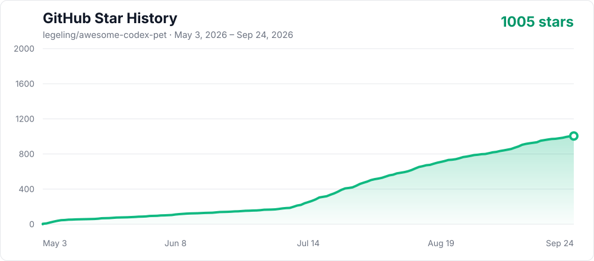

<div align="center">

# Awesome Codex Pet

[简体中文](./docs/zh-CN/README.md) | English

<h2><a href="https://codexpet.top">Open the curated gallery at codexpet.top →</a></h2>

<p><strong>The website is the primary experience.</strong> Browse complete animations, collections, creator pages, community favorites, and install any pet without cloning this repository.</p>

<p><a href="https://codexpet.top"><strong>Browse pets</strong></a> · <a href="https://codexpet.top/install"><strong>Install a pet</strong></a> · <a href="https://codexpet.top/guide"><strong>Craft and submit</strong></a></p>

<a href="https://codexpet.top"></a>

      [](https://github.com/legeling/awesome-codex-pet/actions/workflows/pet-previews.yml)

</div>

This repository is the source catalog behind [codexpet.top](https://codexpet.top): it keeps installable pet packages, creator attribution, collection metadata, validation tools, and contribution history. For browsing and installing pets, start with the website.

## Highlights

- **One-command install** — no clone, no manual setup, works on macOS / Linux / Windows
- **Selected pet gallery** — complete animation previews, collections, creator credits, sharing, and community statistics at [codexpet.top](https://codexpet.top)
- **AI-first contributions** — open the workflow in local Codex or copy its prompt, then request community production or create and submit your own pet; advanced contributors can still open a PR
- **Open licensing** — code under MIT, pet assets under CC BY-NC 4.0

Each pet is a small shareable package:

```text
pets/<pet-slug>--<author-slug>/
├── submission.json
├── pet.json
└── spritesheet.webp
```

Preview images are generated into `assets/previews/<pet-id>/` as local or CI build output, never inside the pet folder.

Repository-defined series and collections live in `collections.json`. Use `kind: franchise` for pets from the same original work and `kind: theme` for cross-franchise groups connected by a shared subject or style. A pet joins either by listing its slug in `submission.json.collections`; the catalog and website are generated from that metadata. Membership is recorded immediately, while the website publishes a collection only after it has at least three pets.

`submission.json.name` is the required fallback name. Creators may keep a pet single-language by omitting `localized_names`, or opt into bilingual naming by providing both `localized_names.en` and `localized_names.zh`. The website follows the visitor's selected language and never invents a translation.

## Pet Versions

| Version | Atlas                            | Runtime metadata                            | Use                                                   |
| ------- | -------------------------------- | ------------------------------------------- | ----------------------------------------------------- |
| v1      | `1536x1872`, 8 columns × 9 rows  | omit `spriteVersionNumber` or set it to `1` | Existing standard-animation pets                      |
| v2      | `1536x2288`, 8 columns × 11 rows | set `spriteVersionNumber: 2`                | Standard animations plus 16 clockwise look directions |

Both versions remain installable. Use v1 when maintaining an existing 9-row pet; use v2 for newly upgraded pets that need directional looking.

## Quick Install

No clone required. Pick the script for your shell:

```bash
# macOS / Linux
curl -fsSL https://raw.githubusercontent.com/legeling/awesome-codex-pet/main/scripts/install-pet.sh | bash -s -- firefly--lingxiaotian
```

```powershell
# Windows PowerShell
powershell -NoProfile -ExecutionPolicy Bypass -Command "iwr -UseB https://raw.githubusercontent.com/legeling/awesome-codex-pet/main/scripts/install-pet.ps1 | iex; Install-CodexPet firefly--lingxiaotian"
```

```bash
# Anywhere with Node.js
npx awesome-codex-pet firefly--lingxiaotian
```

List available pets:

```bash
curl -fsSL https://raw.githubusercontent.com/legeling/awesome-codex-pet/main/scripts/install-pet.sh | bash -s -- --list
```

Default install locations:

- macOS / Linux: `~/.codex/pets/<pet-id>/`
- Windows: `%USERPROFILE%\.codex\pets\<pet-id>\`

Set `CODEX_HOME` to override, or `AWESOME_CODEX_PET_NO_STATS=1` to opt out of anonymous install counters.

## Upgrade an Existing v1 Pet

1. Open Codex **Settings → Pets**.
2. Find the installed custom pet and choose **Update**.
3. Codex opens a Hatch Pet task. The current v2 workflow validates and preserves the existing 9 animation rows, generates four cardinal anchors plus 16 look directions, then writes an 11-row atlas with `spriteVersionNumber: 2`.
4. Review the generated contact sheet and direction previews before accepting the replacement.

The **Update** action is an AI-assisted v1-to-v2 conversion, not a download notification from this repository. It updates the local package under `~/.codex/pets/`; it does not modify or submit the GitHub copy automatically.

## Pets

### Game Characters

<table>
<tr><th>Name</th><td colspan="5"><a href="./pets/firefly--lingxiaotian">Firefly</a> · by <a href="https://github.com/legeling">@legeling</a> · Game Characters · v1</td></tr>
<tr><th>Install</th><td colspan="5"><code>curl -fsSL https://raw.githubusercontent.com/legeling/awesome-codex-pet/main/scripts/install-pet.sh | bash -s -- firefly--lingxiaotian</code></td></tr>
<tr><th>Action</th><td><strong>Idle</strong></td><td><strong>Waving</strong></td><td><strong>Running</strong></td><td><strong>Waiting</strong></td><td><strong>Review</strong></td></tr>
<tr><th>Preview</th><td></td><td></td><td></td><td></td><td></td></tr>
</table>

<table>
<tr><th>Name</th><td colspan="5"><a href="./pets/acheron--lingxiaotian">Acheron</a> · by <a href="https://github.com/legeling">@legeling</a> · Game Characters · v1</td></tr>
<tr><th>Install</th><td colspan="5"><code>curl -fsSL https://raw.githubusercontent.com/legeling/awesome-codex-pet/main/scripts/install-pet.sh | bash -s -- acheron--lingxiaotian</code></td></tr>
<tr><th>Action</th><td><strong>Idle</strong></td><td><strong>Waving</strong></td><td><strong>Running</strong></td><td><strong>Waiting</strong></td><td><strong>Review</strong></td></tr>
<tr><th>Preview</th><td></td><td></td><td></td><td></td><td></td></tr>
</table>

<table>
<tr><th>Name</th><td colspan="5"><a href="./pets/arlecchino--lingxiaotian">Arlecchino</a> · by <a href="https://github.com/legeling">@legeling</a> · Game Characters · v1</td></tr>
<tr><th>Install</th><td colspan="5"><code>curl -fsSL https://raw.githubusercontent.com/legeling/awesome-codex-pet/main/scripts/install-pet.sh | bash -s -- arlecchino--lingxiaotian</code></td></tr>
<tr><th>Action</th><td><strong>Idle</strong></td><td><strong>Waving</strong></td><td><strong>Running</strong></td><td><strong>Waiting</strong></td><td><strong>Review</strong></td></tr>
<tr><th>Preview</th><td></td><td></td><td></td><td></td><td></td></tr>
</table>

<table>
<tr><th>Name</th><td colspan="5"><a href="./pets/black-swan--lingxiaotian">Black Swan</a> · by <a href="https://github.com/legeling">@legeling</a> · Game Characters · v1</td></tr>
<tr><th>Install</th><td colspan="5"><code>curl -fsSL https://raw.githubusercontent.com/legeling/awesome-codex-pet/main/scripts/install-pet.sh | bash -s -- black-swan--lingxiaotian</code></td></tr>
<tr><th>Action</th><td><strong>Idle</strong></td><td><strong>Waving</strong></td><td><strong>Running</strong></td><td><strong>Waiting</strong></td><td><strong>Review</strong></td></tr>
<tr><th>Preview</th><td></td><td></td><td></td><td></td><td></td></tr>
</table>

<table>
<tr><th>Name</th><td colspan="5"><a href="./pets/buba--yurcek">Buba</a> · by @yurcek · Game Characters · v1</td></tr>
<tr><th>Install</th><td colspan="5"><code>curl -fsSL https://raw.githubusercontent.com/legeling/awesome-codex-pet/main/scripts/install-pet.sh | bash -s -- buba--yurcek</code></td></tr>
<tr><th>Action</th><td><strong>Idle</strong></td><td><strong>Waving</strong></td><td><strong>Running</strong></td><td><strong>Waiting</strong></td><td><strong>Review</strong></td></tr>
<tr><th>Preview</th><td></td><td></td><td></td><td></td><td></td></tr>
</table>

<table>
<tr><th>Name</th><td colspan="5"><a href="./pets/castorice--lingxiaotian">Castorice</a> · by <a href="https://github.com/legeling">@legeling</a> · Game Characters · v1</td></tr>
<tr><th>Install</th><td colspan="5"><code>curl -fsSL https://raw.githubusercontent.com/legeling/awesome-codex-pet/main/scripts/install-pet.sh | bash -s -- castorice--lingxiaotian</code></td></tr>
<tr><th>Action</th><td><strong>Idle</strong></td><td><strong>Waving</strong></td><td><strong>Running</strong></td><td><strong>Waiting</strong></td><td><strong>Review</strong></td></tr>
<tr><th>Preview</th><td></td><td></td><td></td><td></td><td></td></tr>
</table>

<table>
<tr><th>Name</th><td colspan="5"><a href="./pets/chen--chenxin-dlut">Ch'en</a> · by <a href="https://github.com/chenxin-dlut">@chenxin-dlut</a> · Game Characters · v1</td></tr>
<tr><th>Install</th><td colspan="5"><code>curl -fsSL https://raw.githubusercontent.com/legeling/awesome-codex-pet/main/scripts/install-pet.sh | bash -s -- chen--chenxin-dlut</code></td></tr>
<tr><th>Action</th><td><strong>Idle</strong></td><td><strong>Waving</strong></td><td><strong>Running</strong></td><td><strong>Waiting</strong></td><td><strong>Review</strong></td></tr>
<tr><th>Preview</th><td></td><td></td><td></td><td></td><td></td></tr>
</table>

<table>
<tr><th>Name</th><td colspan="5"><a href="./pets/cyrene--lingxiaotian">Cyrene</a> · by <a href="https://github.com/legeling">@legeling</a> · Game Characters · v1</td></tr>
<tr><th>Install</th><td colspan="5"><code>curl -fsSL https://raw.githubusercontent.com/legeling/awesome-codex-pet/main/scripts/install-pet.sh | bash -s -- cyrene--lingxiaotian</code></td></tr>
<tr><th>Action</th><td><strong>Idle</strong></td><td><strong>Waving</strong></td><td><strong>Running</strong></td><td><strong>Waiting</strong></td><td><strong>Review</strong></td></tr>
<tr><th>Preview</th><td></td><td></td><td></td><td></td><td></td></tr>
</table>

<table>
<tr><th>Name</th><td colspan="5"><a href="./pets/dimo-stand--god-wu">Dimo</a> · by @god-wu · Game Characters · v1</td></tr>
<tr><th>Install</th><td colspan="5"><code>curl -fsSL https://raw.githubusercontent.com/legeling/awesome-codex-pet/main/scripts/install-pet.sh | bash -s -- dimo-stand--god-wu</code></td></tr>
<tr><th>Action</th><td><strong>Idle</strong></td><td><strong>Waving</strong></td><td><strong>Running</strong></td><td><strong>Waiting</strong></td><td><strong>Review</strong></td></tr>
<tr><th>Preview</th><td></td><td></td><td></td><td></td><td></td></tr>
</table>

<table>
<tr><th>Name</th><td colspan="5"><a href="./pets/doro--lingxiaotian">Doro</a> · by <a href="https://github.com/legeling">@legeling</a> · Game Characters · v1</td></tr>
<tr><th>Install</th><td colspan="5"><code>curl -fsSL https://raw.githubusercontent.com/legeling/awesome-codex-pet/main/scripts/install-pet.sh | bash -s -- doro--lingxiaotian</code></td></tr>
<tr><th>Action</th><td><strong>Idle</strong></td><td><strong>Waving</strong></td><td><strong>Running</strong></td><td><strong>Waiting</strong></td><td><strong>Review</strong></td></tr>
<tr><th>Preview</th><td></td><td></td><td></td><td></td><td></td></tr>
</table>

<table>
<tr><th>Name</th><td colspan="5"><a href="./pets/feixiao--lingxiaotian">Feixiao</a> · by <a href="https://github.com/legeling">@legeling</a> · Game Characters · v1</td></tr>
<tr><th>Install</th><td colspan="5"><code>curl -fsSL https://raw.githubusercontent.com/legeling/awesome-codex-pet/main/scripts/install-pet.sh | bash -s -- feixiao--lingxiaotian</code></td></tr>
<tr><th>Action</th><td><strong>Idle</strong></td><td><strong>Waving</strong></td><td><strong>Running</strong></td><td><strong>Waiting</strong></td><td><strong>Review</strong></td></tr>
<tr><th>Preview</th><td></td><td></td><td></td><td></td><td></td></tr>
</table>

<table>
<tr><th>Name</th><td colspan="5"><a href="./pets/furina--lingxiaotian">Furina</a> · by <a href="https://github.com/legeling">@legeling</a> · Game Characters · v1</td></tr>
<tr><th>Install</th><td colspan="5"><code>curl -fsSL https://raw.githubusercontent.com/legeling/awesome-codex-pet/main/scripts/install-pet.sh | bash -s -- furina--lingxiaotian</code></td></tr>
<tr><th>Action</th><td><strong>Idle</strong></td><td><strong>Waving</strong></td><td><strong>Running</strong></td><td><strong>Waiting</strong></td><td><strong>Review</strong></td></tr>
<tr><th>Preview</th><td></td><td></td><td></td><td></td><td></td></tr>
</table>

<table>
<tr><th>Name</th><td colspan="5"><a href="./pets/ganyu--chenxin-dlut">Ganyu</a> · by <a href="https://github.com/chenxin-dlut">@chenxin-dlut</a> · Game Characters · v1</td></tr>
<tr><th>Install</th><td colspan="5"><code>curl -fsSL https://raw.githubusercontent.com/legeling/awesome-codex-pet/main/scripts/install-pet.sh | bash -s -- ganyu--chenxin-dlut</code></td></tr>
<tr><th>Action</th><td><strong>Idle</strong></td><td><strong>Waving</strong></td><td><strong>Running</strong></td><td><strong>Waiting</strong></td><td><strong>Review</strong></td></tr>
<tr><th>Preview</th><td></td><td></td><td></td><td></td><td></td></tr>
</table>

<table>
<tr><th>Name</th><td colspan="5"><a href="./pets/hu-tao--lingxiaotian">Hu Tao</a> · by <a href="https://github.com/legeling">@legeling</a> · Game Characters · v1</td></tr>
<tr><th>Install</th><td colspan="5"><code>curl -fsSL https://raw.githubusercontent.com/legeling/awesome-codex-pet/main/scripts/install-pet.sh | bash -s -- hu-tao--lingxiaotian</code></td></tr>
<tr><th>Action</th><td><strong>Idle</strong></td><td><strong>Waving</strong></td><td><strong>Running</strong></td><td><strong>Waiting</strong></td><td><strong>Review</strong></td></tr>
<tr><th>Preview</th><td></td><td></td><td></td><td></td><td></td></tr>
</table>

<table>
<tr><th>Name</th><td colspan="5"><a href="./pets/hyacine--kurisu">Hyacine</a> · by <a href="https://github.com/kurisu994">@kurisu994</a> · Game Characters · v2</td></tr>
<tr><th>Install</th><td colspan="5"><code>curl -fsSL https://raw.githubusercontent.com/legeling/awesome-codex-pet/main/scripts/install-pet.sh | bash -s -- hyacine--kurisu</code></td></tr>
<tr><th>Action</th><td><strong>Idle</strong></td><td><strong>Waving</strong></td><td><strong>Running</strong></td><td><strong>Waiting</strong></td><td><strong>Review</strong></td></tr>
<tr><th>Preview</th><td></td><td></td><td></td><td></td><td></td></tr>
</table>

<table>
<tr><th>Name</th><td colspan="5"><a href="./pets/isaac--foggy-whale">Isaac</a> · by <a href="https://github.com/Foggy-whale">@Foggy-whale</a> · Game Characters · v2</td></tr>
<tr><th>Install</th><td colspan="5"><code>curl -fsSL https://raw.githubusercontent.com/legeling/awesome-codex-pet/main/scripts/install-pet.sh | bash -s -- isaac--foggy-whale</code></td></tr>
<tr><th>Action</th><td><strong>Idle</strong></td><td><strong>Waving</strong></td><td><strong>Running</strong></td><td><strong>Waiting</strong></td><td><strong>Review</strong></td></tr>
<tr><th>Preview</th><td></td><td></td><td></td><td></td><td></td></tr>
</table>

<table>
<tr><th>Name</th><td colspan="5"><a href="./pets/kamisato-ayaka--lingxiaotian">Kamisato Ayaka</a> · by <a href="https://github.com/legeling">@legeling</a> · Game Characters · v1</td></tr>
<tr><th>Install</th><td colspan="5"><code>curl -fsSL https://raw.githubusercontent.com/legeling/awesome-codex-pet/main/scripts/install-pet.sh | bash -s -- kamisato-ayaka--lingxiaotian</code></td></tr>
<tr><th>Action</th><td><strong>Idle</strong></td><td><strong>Waving</strong></td><td><strong>Running</strong></td><td><strong>Waiting</strong></td><td><strong>Review</strong></td></tr>
<tr><th>Preview</th><td></td><td></td><td></td><td></td><td></td></tr>
</table>

<table>
<tr><th>Name</th><td colspan="5"><a href="./pets/klee--chenxin-dlut">Klee</a> · by <a href="https://github.com/chenxin-dlut">@chenxin-dlut</a> · Game Characters · v1</td></tr>
<tr><th>Install</th><td colspan="5"><code>curl -fsSL https://raw.githubusercontent.com/legeling/awesome-codex-pet/main/scripts/install-pet.sh | bash -s -- klee--chenxin-dlut</code></td></tr>
<tr><th>Action</th><td><strong>Idle</strong></td><td><strong>Waving</strong></td><td><strong>Running</strong></td><td><strong>Waiting</strong></td><td><strong>Review</strong></td></tr>
<tr><th>Preview</th><td></td><td></td><td></td><td></td><td></td></tr>
</table>

<table>
<tr><th>Name</th><td colspan="5"><a href="./pets/lappland--chenxin-dlut">Lappland</a> · by <a href="https://github.com/chenxin-dlut">@chenxin-dlut</a> · Game Characters · v1</td></tr>
<tr><th>Install</th><td colspan="5"><code>curl -fsSL https://raw.githubusercontent.com/legeling/awesome-codex-pet/main/scripts/install-pet.sh | bash -s -- lappland--chenxin-dlut</code></td></tr>
<tr><th>Action</th><td><strong>Idle</strong></td><td><strong>Waving</strong></td><td><strong>Running</strong></td><td><strong>Waiting</strong></td><td><strong>Review</strong></td></tr>
<tr><th>Preview</th><td></td><td></td><td></td><td></td><td></td></tr>
</table>

<table>
<tr><th>Name</th><td colspan="5"><a href="./pets/little-black-mage--libertis">Little Black Mage</a> · by @libertis · Game Characters · v1</td></tr>
<tr><th>Install</th><td colspan="5"><code>curl -fsSL https://raw.githubusercontent.com/legeling/awesome-codex-pet/main/scripts/install-pet.sh | bash -s -- little-black-mage--libertis</code></td></tr>
<tr><th>Action</th><td><strong>Idle</strong></td><td><strong>Waving</strong></td><td><strong>Running</strong></td><td><strong>Waiting</strong></td><td><strong>Review</strong></td></tr>
<tr><th>Preview</th><td></td><td></td><td></td><td></td><td></td></tr>
</table>

<table>
<tr><th>Name</th><td colspan="5"><a href="./pets/march-7th--chenxin-dlut">March 7th</a> · by <a href="https://github.com/chenxin-dlut">@chenxin-dlut</a> · Game Characters · v1</td></tr>
<tr><th>Install</th><td colspan="5"><code>curl -fsSL https://raw.githubusercontent.com/legeling/awesome-codex-pet/main/scripts/install-pet.sh | bash -s -- march-7th--chenxin-dlut</code></td></tr>
<tr><th>Action</th><td><strong>Idle</strong></td><td><strong>Waving</strong></td><td><strong>Running</strong></td><td><strong>Waiting</strong></td><td><strong>Review</strong></td></tr>
<tr><th>Preview</th><td></td><td></td><td></td><td></td><td></td></tr>
</table>

<table>
<tr><th>Name</th><td colspan="5"><a href="./pets/miyabi--eric-terminal">Miyabi</a> · by <a href="https://codex-pets.net/users/eric-terminal">@eric-terminal</a> · Game Characters · v1</td></tr>
<tr><th>Install</th><td colspan="5"><code>curl -fsSL https://raw.githubusercontent.com/legeling/awesome-codex-pet/main/scripts/install-pet.sh | bash -s -- miyabi--eric-terminal</code></td></tr>
<tr><th>Action</th><td><strong>Idle</strong></td><td><strong>Waving</strong></td><td><strong>Running</strong></td><td><strong>Waiting</strong></td><td><strong>Review</strong></td></tr>
<tr><th>Preview</th><td></td><td></td><td></td><td></td><td></td></tr>
</table>

<table>
<tr><th>Name</th><td colspan="5"><a href="./pets/nahida--lingxiaotian">Nahida</a> · by <a href="https://github.com/legeling">@legeling</a> · Game Characters · v1</td></tr>
<tr><th>Install</th><td colspan="5"><code>curl -fsSL https://raw.githubusercontent.com/legeling/awesome-codex-pet/main/scripts/install-pet.sh | bash -s -- nahida--lingxiaotian</code></td></tr>
<tr><th>Action</th><td><strong>Idle</strong></td><td><strong>Waving</strong></td><td><strong>Running</strong></td><td><strong>Waiting</strong></td><td><strong>Review</strong></td></tr>
<tr><th>Preview</th><td></td><td></td><td></td><td></td><td></td></tr>
</table>

<table>
<tr><th>Name</th><td colspan="5"><a href="./pets/navia--lingxiaotian">Navia</a> · by <a href="https://github.com/legeling">@legeling</a> · Game Characters · v1</td></tr>
<tr><th>Install</th><td colspan="5"><code>curl -fsSL https://raw.githubusercontent.com/legeling/awesome-codex-pet/main/scripts/install-pet.sh | bash -s -- navia--lingxiaotian</code></td></tr>
<tr><th>Action</th><td><strong>Idle</strong></td><td><strong>Waving</strong></td><td><strong>Running</strong></td><td><strong>Waiting</strong></td><td><strong>Review</strong></td></tr>
<tr><th>Preview</th><td></td><td></td><td></td><td></td><td></td></tr>
</table>

<table>
<tr><th>Name</th><td colspan="5"><a href="./pets/paimon--lingxiaotian">Paimon</a> · by <a href="https://github.com/legeling">@legeling</a> · Game Characters · v1</td></tr>
<tr><th>Install</th><td colspan="5"><code>curl -fsSL https://raw.githubusercontent.com/legeling/awesome-codex-pet/main/scripts/install-pet.sh | bash -s -- paimon--lingxiaotian</code></td></tr>
<tr><th>Action</th><td><strong>Idle</strong></td><td><strong>Waving</strong></td><td><strong>Running</strong></td><td><strong>Waiting</strong></td><td><strong>Review</strong></td></tr>
<tr><th>Preview</th><td></td><td></td><td></td><td></td><td></td></tr>
</table>

<table>
<tr><th>Name</th><td colspan="5"><a href="./pets/phoebe--chenxin-dlut">Phoebe</a> · by <a href="https://github.com/chenxin-dlut">@chenxin-dlut</a> · Game Characters · v1</td></tr>
<tr><th>Install</th><td colspan="5"><code>curl -fsSL https://raw.githubusercontent.com/legeling/awesome-codex-pet/main/scripts/install-pet.sh | bash -s -- phoebe--chenxin-dlut</code></td></tr>
<tr><th>Action</th><td><strong>Idle</strong></td><td><strong>Waving</strong></td><td><strong>Running</strong></td><td><strong>Waiting</strong></td><td><strong>Review</strong></td></tr>
<tr><th>Preview</th><td></td><td></td><td></td><td></td><td></td></tr>
</table>

<table>
<tr><th>Name</th><td colspan="5"><a href="./pets/raiden-shogun--lingxiaotian">Raiden Shogun</a> · by <a href="https://github.com/legeling">@legeling</a> · Game Characters · v1</td></tr>
<tr><th>Install</th><td colspan="5"><code>curl -fsSL https://raw.githubusercontent.com/legeling/awesome-codex-pet/main/scripts/install-pet.sh | bash -s -- raiden-shogun--lingxiaotian</code></td></tr>
<tr><th>Action</th><td><strong>Idle</strong></td><td><strong>Waving</strong></td><td><strong>Running</strong></td><td><strong>Waiting</strong></td><td><strong>Review</strong></td></tr>
<tr><th>Preview</th><td></td><td></td><td></td><td></td><td></td></tr>
</table>

<table>
<tr><th>Name</th><td colspan="5"><a href="./pets/reimu--lingxiaotian">Reimu</a> · by <a href="https://github.com/legeling">@legeling</a> · Game Characters · v1</td></tr>
<tr><th>Install</th><td colspan="5"><code>curl -fsSL https://raw.githubusercontent.com/legeling/awesome-codex-pet/main/scripts/install-pet.sh | bash -s -- reimu--lingxiaotian</code></td></tr>
<tr><th>Action</th><td><strong>Idle</strong></td><td><strong>Waving</strong></td><td><strong>Running</strong></td><td><strong>Waiting</strong></td><td><strong>Review</strong></td></tr>
<tr><th>Preview</th><td></td><td></td><td></td><td></td><td></td></tr>
</table>

<table>
<tr><th>Name</th><td colspan="5"><a href="./pets/robin--lingxiaotian">Robin</a> · by <a href="https://github.com/legeling">@legeling</a> · Game Characters · v1</td></tr>
<tr><th>Install</th><td colspan="5"><code>curl -fsSL https://raw.githubusercontent.com/legeling/awesome-codex-pet/main/scripts/install-pet.sh | bash -s -- robin--lingxiaotian</code></td></tr>
<tr><th>Action</th><td><strong>Idle</strong></td><td><strong>Waving</strong></td><td><strong>Running</strong></td><td><strong>Waiting</strong></td><td><strong>Review</strong></td></tr>
<tr><th>Preview</th><td></td><td></td><td></td><td></td><td></td></tr>
</table>

<table>
<tr><th>Name</th><td colspan="5"><a href="./pets/ruan-mei--lingxiaotian">Ruan Mei</a> · by <a href="https://github.com/legeling">@legeling</a> · Game Characters · v1</td></tr>
<tr><th>Install</th><td colspan="5"><code>curl -fsSL https://raw.githubusercontent.com/legeling/awesome-codex-pet/main/scripts/install-pet.sh | bash -s -- ruan-mei--lingxiaotian</code></td></tr>
<tr><th>Action</th><td><strong>Idle</strong></td><td><strong>Waving</strong></td><td><strong>Running</strong></td><td><strong>Waiting</strong></td><td><strong>Review</strong></td></tr>
<tr><th>Preview</th><td></td><td></td><td></td><td></td><td></td></tr>
</table>

<table>
<tr><th>Name</th><td colspan="5"><a href="./pets/silver-wolf--lingxiaotian">Silver Wolf</a> · by <a href="https://github.com/legeling">@legeling</a> · Game Characters · v1</td></tr>
<tr><th>Install</th><td colspan="5"><code>curl -fsSL https://raw.githubusercontent.com/legeling/awesome-codex-pet/main/scripts/install-pet.sh | bash -s -- silver-wolf--lingxiaotian</code></td></tr>
<tr><th>Action</th><td><strong>Idle</strong></td><td><strong>Waving</strong></td><td><strong>Running</strong></td><td><strong>Waiting</strong></td><td><strong>Review</strong></td></tr>
<tr><th>Preview</th><td></td><td></td><td></td><td></td><td></td></tr>
</table>

<table>
<tr><th>Name</th><td colspan="5"><a href="./pets/sonetto--chenxin-dlut">Sonetto</a> · by <a href="https://github.com/chenxin-dlut">@chenxin-dlut</a> · Game Characters · v1</td></tr>
<tr><th>Install</th><td colspan="5"><code>curl -fsSL https://raw.githubusercontent.com/legeling/awesome-codex-pet/main/scripts/install-pet.sh | bash -s -- sonetto--chenxin-dlut</code></td></tr>
<tr><th>Action</th><td><strong>Idle</strong></td><td><strong>Waving</strong></td><td><strong>Running</strong></td><td><strong>Waiting</strong></td><td><strong>Review</strong></td></tr>
<tr><th>Preview</th><td></td><td></td><td></td><td></td><td></td></tr>
</table>

<table>
<tr><th>Name</th><td colspan="5"><a href="./pets/sparkle--lingxiaotian">Sparkle</a> · by <a href="https://github.com/legeling">@legeling</a> · Game Characters · v1</td></tr>
<tr><th>Install</th><td colspan="5"><code>curl -fsSL https://raw.githubusercontent.com/legeling/awesome-codex-pet/main/scripts/install-pet.sh | bash -s -- sparkle--lingxiaotian</code></td></tr>
<tr><th>Action</th><td><strong>Idle</strong></td><td><strong>Waving</strong></td><td><strong>Running</strong></td><td><strong>Waiting</strong></td><td><strong>Review</strong></td></tr>
<tr><th>Preview</th><td></td><td></td><td></td><td></td><td></td></tr>
</table>

<table>
<tr><th>Name</th><td colspan="5"><a href="./pets/tingyun--lingxiaotian">Tingyun</a> · by <a href="https://github.com/legeling">@legeling</a> · Game Characters · v1</td></tr>
<tr><th>Install</th><td colspan="5"><code>curl -fsSL https://raw.githubusercontent.com/legeling/awesome-codex-pet/main/scripts/install-pet.sh | bash -s -- tingyun--lingxiaotian</code></td></tr>
<tr><th>Action</th><td><strong>Idle</strong></td><td><strong>Waving</strong></td><td><strong>Running</strong></td><td><strong>Waiting</strong></td><td><strong>Review</strong></td></tr>
<tr><th>Preview</th><td></td><td></td><td></td><td></td><td></td></tr>
</table>

<table>
<tr><th>Name</th><td colspan="5"><a href="./pets/vertin--chenxin-dlut">Vertin</a> · by <a href="https://github.com/chenxin-dlut">@chenxin-dlut</a> · Game Characters · v1</td></tr>
<tr><th>Install</th><td colspan="5"><code>curl -fsSL https://raw.githubusercontent.com/legeling/awesome-codex-pet/main/scripts/install-pet.sh | bash -s -- vertin--chenxin-dlut</code></td></tr>
<tr><th>Action</th><td><strong>Idle</strong></td><td><strong>Waving</strong></td><td><strong>Running</strong></td><td><strong>Waiting</strong></td><td><strong>Review</strong></td></tr>
<tr><th>Preview</th><td></td><td></td><td></td><td></td><td></td></tr>
</table>

<table>
<tr><th>Name</th><td colspan="5"><a href="./pets/yoimiya--chenxin-dlut">Yoimiya</a> · by <a href="https://github.com/chenxin-dlut">@chenxin-dlut</a> · Game Characters · v1</td></tr>
<tr><th>Install</th><td colspan="5"><code>curl -fsSL https://raw.githubusercontent.com/legeling/awesome-codex-pet/main/scripts/install-pet.sh | bash -s -- yoimiya--chenxin-dlut</code></td></tr>
<tr><th>Action</th><td><strong>Idle</strong></td><td><strong>Waving</strong></td><td><strong>Running</strong></td><td><strong>Waiting</strong></td><td><strong>Review</strong></td></tr>
<tr><th>Preview</th><td></td><td></td><td></td><td></td><td></td></tr>
</table>

<table>
<tr><th>Name</th><td colspan="5"><a href="./pets/zani--chenxin-dlut">Zani</a> · by <a href="https://github.com/chenxin-dlut">@chenxin-dlut</a> · Game Characters · v1</td></tr>
<tr><th>Install</th><td colspan="5"><code>curl -fsSL https://raw.githubusercontent.com/legeling/awesome-codex-pet/main/scripts/install-pet.sh | bash -s -- zani--chenxin-dlut</code></td></tr>
<tr><th>Action</th><td><strong>Idle</strong></td><td><strong>Waving</strong></td><td><strong>Running</strong></td><td><strong>Waiting</strong></td><td><strong>Review</strong></td></tr>
<tr><th>Preview</th><td></td><td></td><td></td><td></td><td></td></tr>
</table>

<table>
<tr><th>Name</th><td colspan="5"><a href="./pets/dnf-female-ammo--qunboo">女弹药Q</a> · by <a href="https://github.com/QunBoo">@QunBoo</a> · Game Characters · v1</td></tr>
<tr><th>Install</th><td colspan="5"><code>curl -fsSL https://raw.githubusercontent.com/legeling/awesome-codex-pet/main/scripts/install-pet.sh | bash -s -- dnf-female-ammo--qunboo</code></td></tr>
<tr><th>Action</th><td><strong>Idle</strong></td><td><strong>Waving</strong></td><td><strong>Running</strong></td><td><strong>Waiting</strong></td><td><strong>Review</strong></td></tr>
<tr><th>Preview</th><td></td><td></td><td></td><td></td><td></td></tr>
</table>

<table>
<tr><th>Name</th><td colspan="5"><a href="./pets/new-covenant-exusiai--chenxin-dlut">Exusiai the New Covenant</a> · by <a href="https://github.com/chenxin-dlut">@chenxin-dlut</a> · Game Characters · v1</td></tr>
<tr><th>Install</th><td colspan="5"><code>curl -fsSL https://raw.githubusercontent.com/legeling/awesome-codex-pet/main/scripts/install-pet.sh | bash -s -- new-covenant-exusiai--chenxin-dlut</code></td></tr>
<tr><th>Action</th><td><strong>Idle</strong></td><td><strong>Waving</strong></td><td><strong>Running</strong></td><td><strong>Waiting</strong></td><td><strong>Review</strong></td></tr>
<tr><th>Preview</th><td></td><td></td><td></td><td></td><td></td></tr>
</table>

<table>
<tr><th>Name</th><td colspan="5"><a href="./pets/regulus-star-antimony--chenxin-dlut">Regulus</a> · by <a href="https://github.com/chenxin-dlut">@chenxin-dlut</a> · Game Characters · v1</td></tr>
<tr><th>Install</th><td colspan="5"><code>curl -fsSL https://raw.githubusercontent.com/legeling/awesome-codex-pet/main/scripts/install-pet.sh | bash -s -- regulus-star-antimony--chenxin-dlut</code></td></tr>
<tr><th>Action</th><td><strong>Idle</strong></td><td><strong>Waving</strong></td><td><strong>Running</strong></td><td><strong>Waiting</strong></td><td><strong>Review</strong></td></tr>
<tr><th>Preview</th><td></td><td></td><td></td><td></td><td></td></tr>
</table>

<table>
<tr><th>Name</th><td colspan="5"><a href="./pets/youmu--ai-generated">魂魄妖梦</a> · by @ai-generated · Game Characters · v2</td></tr>
<tr><th>Install</th><td colspan="5"><code>curl -fsSL https://raw.githubusercontent.com/legeling/awesome-codex-pet/main/scripts/install-pet.sh | bash -s -- youmu--ai-generated</code></td></tr>
<tr><th>Action</th><td><strong>Idle</strong></td><td><strong>Waving</strong></td><td><strong>Running</strong></td><td><strong>Waiting</strong></td><td><strong>Review</strong></td></tr>
<tr><th>Preview</th><td></td><td></td><td></td><td></td><td></td></tr>
</table>

### Anime Characters

<table>
<tr><th>Name</th><td colspan="5"><a href="./pets/zero-two--mingqingmozhao">Zero Two</a> · by @mingqingmozhao · Anime Characters · v1</td></tr>
<tr><th>Install</th><td colspan="5"><code>curl -fsSL https://raw.githubusercontent.com/legeling/awesome-codex-pet/main/scripts/install-pet.sh | bash -s -- zero-two--mingqingmozhao</code></td></tr>
<tr><th>Action</th><td><strong>Idle</strong></td><td><strong>Waving</strong></td><td><strong>Running</strong></td><td><strong>Waiting</strong></td><td><strong>Review</strong></td></tr>
<tr><th>Preview</th><td></td><td></td><td></td><td></td><td></td></tr>
</table>

<table>
<tr><th>Name</th><td colspan="5"><a href="./pets/anya--chenxin-dlut">Anya</a> · by <a href="https://github.com/chenxin-dlut">@chenxin-dlut</a> · Anime Characters · v1</td></tr>
<tr><th>Install</th><td colspan="5"><code>curl -fsSL https://raw.githubusercontent.com/legeling/awesome-codex-pet/main/scripts/install-pet.sh | bash -s -- anya--chenxin-dlut</code></td></tr>
<tr><th>Action</th><td><strong>Idle</strong></td><td><strong>Waving</strong></td><td><strong>Running</strong></td><td><strong>Waiting</strong></td><td><strong>Review</strong></td></tr>
<tr><th>Preview</th><td></td><td></td><td></td><td></td><td></td></tr>
</table>

<table>
<tr><th>Name</th><td colspan="5"><a href="./pets/asuka--maxg24">Asuka</a> · by <a href="https://codex-pets.net/users/maxg24">@maxg24</a> · Anime Characters · v1</td></tr>
<tr><th>Install</th><td colspan="5"><code>curl -fsSL https://raw.githubusercontent.com/legeling/awesome-codex-pet/main/scripts/install-pet.sh | bash -s -- asuka--maxg24</code></td></tr>
<tr><th>Action</th><td><strong>Idle</strong></td><td><strong>Waving</strong></td><td><strong>Running</strong></td><td><strong>Waiting</strong></td><td><strong>Review</strong></td></tr>
<tr><th>Preview</th><td></td><td></td><td></td><td></td><td></td></tr>
</table>

<table>
<tr><th>Name</th><td colspan="5"><a href="./pets/chibi-rei-pet--bendy">Rei Ayanami</a> · by @Bendy · Anime Characters · v1</td></tr>
<tr><th>Install</th><td colspan="5"><code>curl -fsSL https://raw.githubusercontent.com/legeling/awesome-codex-pet/main/scripts/install-pet.sh | bash -s -- chibi-rei-pet--bendy</code></td></tr>
<tr><th>Action</th><td><strong>Idle</strong></td><td><strong>Waving</strong></td><td><strong>Running</strong></td><td><strong>Waiting</strong></td><td><strong>Review</strong></td></tr>
<tr><th>Preview</th><td></td><td></td><td></td><td></td><td></td></tr>
</table>

<table>
<tr><th>Name</th><td colspan="5"><a href="./pets/conan--chenxin-dlut">Conan Edogawa</a> · by <a href="https://github.com/chenxin-dlut">@chenxin-dlut</a> · Anime Characters · v1</td></tr>
<tr><th>Install</th><td colspan="5"><code>curl -fsSL https://raw.githubusercontent.com/legeling/awesome-codex-pet/main/scripts/install-pet.sh | bash -s -- conan--chenxin-dlut</code></td></tr>
<tr><th>Action</th><td><strong>Idle</strong></td><td><strong>Waving</strong></td><td><strong>Running</strong></td><td><strong>Waiting</strong></td><td><strong>Review</strong></td></tr>
<tr><th>Preview</th><td></td><td></td><td></td><td></td><td></td></tr>
</table>

<table>
<tr><th>Name</th><td colspan="5"><a href="./pets/doraemon--xueshi">Doraemon</a> · by <a href="https://codex-pets.net/users/xueshi">@xueshi</a> · Anime Characters · v1</td></tr>
<tr><th>Install</th><td colspan="5"><code>curl -fsSL https://raw.githubusercontent.com/legeling/awesome-codex-pet/main/scripts/install-pet.sh | bash -s -- doraemon--xueshi</code></td></tr>
<tr><th>Action</th><td><strong>Idle</strong></td><td><strong>Waving</strong></td><td><strong>Running</strong></td><td><strong>Waiting</strong></td><td><strong>Review</strong></td></tr>
<tr><th>Preview</th><td></td><td></td><td></td><td></td><td></td></tr>
</table>

<table>
<tr><th>Name</th><td colspan="5"><a href="./pets/elaina--nyakku-shigure">Elaina</a> · by <a href="https://codex-pets.net/users/nyakku-shigure">@nyakku-shigure</a> · Anime Characters · v1</td></tr>
<tr><th>Install</th><td colspan="5"><code>curl -fsSL https://raw.githubusercontent.com/legeling/awesome-codex-pet/main/scripts/install-pet.sh | bash -s -- elaina--nyakku-shigure</code></td></tr>
<tr><th>Action</th><td><strong>Idle</strong></td><td><strong>Waving</strong></td><td><strong>Running</strong></td><td><strong>Waiting</strong></td><td><strong>Review</strong></td></tr>
<tr><th>Preview</th><td></td><td></td><td></td><td></td><td></td></tr>
</table>

<table>
<tr><th>Name</th><td colspan="5"><a href="./pets/eren--ash-sw">Eren</a> · by <a href="https://codex-pets.net/users/ash-sw">@ash-sw</a> · Anime Characters · v1</td></tr>
<tr><th>Install</th><td colspan="5"><code>curl -fsSL https://raw.githubusercontent.com/legeling/awesome-codex-pet/main/scripts/install-pet.sh | bash -s -- eren--ash-sw</code></td></tr>
<tr><th>Action</th><td><strong>Idle</strong></td><td><strong>Waving</strong></td><td><strong>Running</strong></td><td><strong>Waiting</strong></td><td><strong>Review</strong></td></tr>
<tr><th>Preview</th><td></td><td></td><td></td><td></td><td></td></tr>
</table>

<table>
<tr><th>Name</th><td colspan="5"><a href="./pets/frieren--lingxiaotian">Frieren</a> · by <a href="https://github.com/legeling">@legeling</a> · Anime Characters · v1</td></tr>
<tr><th>Install</th><td colspan="5"><code>curl -fsSL https://raw.githubusercontent.com/legeling/awesome-codex-pet/main/scripts/install-pet.sh | bash -s -- frieren--lingxiaotian</code></td></tr>
<tr><th>Action</th><td><strong>Idle</strong></td><td><strong>Waving</strong></td><td><strong>Running</strong></td><td><strong>Waiting</strong></td><td><strong>Review</strong></td></tr>
<tr><th>Preview</th><td></td><td></td><td></td><td></td><td></td></tr>
</table>

<table>
<tr><th>Name</th><td colspan="5"><a href="./pets/gojo--lilokhalikfa">Gojo</a> · by <a href="https://codex-pets.net/users/lilokhalikfa">@lilokhalikfa</a> · Anime Characters · v1</td></tr>
<tr><th>Install</th><td colspan="5"><code>curl -fsSL https://raw.githubusercontent.com/legeling/awesome-codex-pet/main/scripts/install-pet.sh | bash -s -- gojo--lilokhalikfa</code></td></tr>
<tr><th>Action</th><td><strong>Idle</strong></td><td><strong>Waving</strong></td><td><strong>Running</strong></td><td><strong>Waiting</strong></td><td><strong>Review</strong></td></tr>
<tr><th>Preview</th><td></td><td></td><td></td><td></td><td></td></tr>
</table>

<table>
<tr><th>Name</th><td colspan="5"><a href="./pets/ikaros--icarus-alpha">Ikaros</a> · by <a href="https://codex-pets.net/users/icarus-alpha">@icarus-alpha</a> · Anime Characters · v1</td></tr>
<tr><th>Install</th><td colspan="5"><code>curl -fsSL https://raw.githubusercontent.com/legeling/awesome-codex-pet/main/scripts/install-pet.sh | bash -s -- ikaros--icarus-alpha</code></td></tr>
<tr><th>Action</th><td><strong>Idle</strong></td><td><strong>Waving</strong></td><td><strong>Running</strong></td><td><strong>Waiting</strong></td><td><strong>Review</strong></td></tr>
<tr><th>Preview</th><td></td><td></td><td></td><td></td><td></td></tr>
</table>

<table>
<tr><th>Name</th><td colspan="5"><a href="./pets/isekaijoucho--siiverash">Isekaijoucho</a> · by <a href="https://github.com/SiIverAsh">@SiIverAsh</a> · Anime Characters · v1</td></tr>
<tr><th>Install</th><td colspan="5"><code>curl -fsSL https://raw.githubusercontent.com/legeling/awesome-codex-pet/main/scripts/install-pet.sh | bash -s -- isekaijoucho--siiverash</code></td></tr>
<tr><th>Action</th><td><strong>Idle</strong></td><td><strong>Waving</strong></td><td><strong>Running</strong></td><td><strong>Waiting</strong></td><td><strong>Review</strong></td></tr>
<tr><th>Preview</th><td></td><td></td><td></td><td></td><td></td></tr>
</table>

<table>
<tr><th>Name</th><td colspan="5"><a href="./pets/jolyne-cujoh--d2682787206-sys">Jolyne Cujoh</a> · by <a href="https://github.com/d2682787206-sys">@d2682787206-sys</a> · Anime Characters · v2</td></tr>
<tr><th>Install</th><td colspan="5"><code>curl -fsSL https://raw.githubusercontent.com/legeling/awesome-codex-pet/main/scripts/install-pet.sh | bash -s -- jolyne-cujoh--d2682787206-sys</code></td></tr>
<tr><th>Action</th><td><strong>Idle</strong></td><td><strong>Waving</strong></td><td><strong>Running</strong></td><td><strong>Waiting</strong></td><td><strong>Review</strong></td></tr>
<tr><th>Preview</th><td></td><td></td><td></td><td></td><td></td></tr>
</table>

<table>
<tr><th>Name</th><td colspan="5"><a href="./pets/kaiju-no-8--terry878">Kaiju No. 8</a> · by @TERRY878 · Anime Characters · v2</td></tr>
<tr><th>Install</th><td colspan="5"><code>curl -fsSL https://raw.githubusercontent.com/legeling/awesome-codex-pet/main/scripts/install-pet.sh | bash -s -- kaiju-no-8--terry878</code></td></tr>
<tr><th>Action</th><td><strong>Idle</strong></td><td><strong>Waving</strong></td><td><strong>Running</strong></td><td><strong>Waiting</strong></td><td><strong>Review</strong></td></tr>
<tr><th>Preview</th><td></td><td></td><td></td><td></td><td></td></tr>
</table>

<table>
<tr><th>Name</th><td colspan="5"><a href="./pets/kid--chenxin-dlut">Kaito Kid</a> · by <a href="https://github.com/chenxin-dlut">@chenxin-dlut</a> · Anime Characters · v1</td></tr>
<tr><th>Install</th><td colspan="5"><code>curl -fsSL https://raw.githubusercontent.com/legeling/awesome-codex-pet/main/scripts/install-pet.sh | bash -s -- kid--chenxin-dlut</code></td></tr>
<tr><th>Action</th><td><strong>Idle</strong></td><td><strong>Waving</strong></td><td><strong>Running</strong></td><td><strong>Waiting</strong></td><td><strong>Review</strong></td></tr>
<tr><th>Preview</th><td></td><td></td><td></td><td></td><td></td></tr>
</table>

<table>
<tr><th>Name</th><td colspan="5"><a href="./pets/kid-goku--julianhuang">Kid Goku</a> · by <a href="https://codex-pets.net/users/julianhuang">@julianhuang</a> · Anime Characters · v1</td></tr>
<tr><th>Install</th><td colspan="5"><code>curl -fsSL https://raw.githubusercontent.com/legeling/awesome-codex-pet/main/scripts/install-pet.sh | bash -s -- kid-goku--julianhuang</code></td></tr>
<tr><th>Action</th><td><strong>Idle</strong></td><td><strong>Waving</strong></td><td><strong>Running</strong></td><td><strong>Waiting</strong></td><td><strong>Review</strong></td></tr>
<tr><th>Preview</th><td></td><td></td><td></td><td></td><td></td></tr>
</table>

<table>
<tr><th>Name</th><td colspan="5"><a href="./pets/levi--emrecb">Levi</a> · by <a href="https://codex-pets.net/users/emrecb">@emrecb</a> · Anime Characters · v1</td></tr>
<tr><th>Install</th><td colspan="5"><code>curl -fsSL https://raw.githubusercontent.com/legeling/awesome-codex-pet/main/scripts/install-pet.sh | bash -s -- levi--emrecb</code></td></tr>
<tr><th>Action</th><td><strong>Idle</strong></td><td><strong>Waving</strong></td><td><strong>Running</strong></td><td><strong>Waiting</strong></td><td><strong>Review</strong></td></tr>
<tr><th>Preview</th><td></td><td></td><td></td><td></td><td></td></tr>
</table>

<table>
<tr><th>Name</th><td colspan="5"><a href="./pets/luffy-gear-5--jordsshmords1">Luffy Gear 5</a> · by <a href="https://codex-pets.net/users/jordsshmords1">@jordsshmords1</a> · Anime Characters · v1</td></tr>
<tr><th>Install</th><td colspan="5"><code>curl -fsSL https://raw.githubusercontent.com/legeling/awesome-codex-pet/main/scripts/install-pet.sh | bash -s -- luffy-gear-5--jordsshmords1</code></td></tr>
<tr><th>Action</th><td><strong>Idle</strong></td><td><strong>Waving</strong></td><td><strong>Running</strong></td><td><strong>Waiting</strong></td><td><strong>Review</strong></td></tr>
<tr><th>Preview</th><td></td><td></td><td></td><td></td><td></td></tr>
</table>

<table>
<tr><th>Name</th><td colspan="5"><a href="./pets/mahiro--lingxiaotian">Mahiro</a> · by <a href="https://github.com/legeling">@legeling</a> · Anime Characters · v1</td></tr>
<tr><th>Install</th><td colspan="5"><code>curl -fsSL https://raw.githubusercontent.com/legeling/awesome-codex-pet/main/scripts/install-pet.sh | bash -s -- mahiro--lingxiaotian</code></td></tr>
<tr><th>Action</th><td><strong>Idle</strong></td><td><strong>Waving</strong></td><td><strong>Running</strong></td><td><strong>Waiting</strong></td><td><strong>Review</strong></td></tr>
<tr><th>Preview</th><td></td><td></td><td></td><td></td><td></td></tr>
</table>

<table>
<tr><th>Name</th><td colspan="5"><a href="./pets/makimamini--1sh1ro">Makima</a> · by @1sh1ro · Anime Characters · v1</td></tr>
<tr><th>Install</th><td colspan="5"><code>curl -fsSL https://raw.githubusercontent.com/legeling/awesome-codex-pet/main/scripts/install-pet.sh | bash -s -- makimamini--1sh1ro</code></td></tr>
<tr><th>Action</th><td><strong>Idle</strong></td><td><strong>Waving</strong></td><td><strong>Running</strong></td><td><strong>Waiting</strong></td><td><strong>Review</strong></td></tr>
<tr><th>Preview</th><td></td><td></td><td></td><td></td><td></td></tr>
</table>

<table>
<tr><th>Name</th><td colspan="5"><a href="./pets/makisekurisu--m1gr4ine">Makise Kurisu</a> · by @m1gr4ine · Anime Characters · v1</td></tr>
<tr><th>Install</th><td colspan="5"><code>curl -fsSL https://raw.githubusercontent.com/legeling/awesome-codex-pet/main/scripts/install-pet.sh | bash -s -- makisekurisu--m1gr4ine</code></td></tr>
<tr><th>Action</th><td><strong>Idle</strong></td><td><strong>Waving</strong></td><td><strong>Running</strong></td><td><strong>Waiting</strong></td><td><strong>Review</strong></td></tr>
<tr><th>Preview</th><td></td><td></td><td></td><td></td><td></td></tr>
</table>

<table>
<tr><th>Name</th><td colspan="5"><a href="./pets/mihari--hyoni1129">Mihari</a> · by <a href="https://github.com/Hyoni1129">@Hyoni1129</a> · Anime Characters · v1</td></tr>
<tr><th>Install</th><td colspan="5"><code>curl -fsSL https://raw.githubusercontent.com/legeling/awesome-codex-pet/main/scripts/install-pet.sh | bash -s -- mihari--hyoni1129</code></td></tr>
<tr><th>Action</th><td><strong>Idle</strong></td><td><strong>Waving</strong></td><td><strong>Running</strong></td><td><strong>Waiting</strong></td><td><strong>Review</strong></td></tr>
<tr><th>Preview</th><td></td><td></td><td></td><td></td><td></td></tr>
</table>

<table>
<tr><th>Name</th><td colspan="5"><a href="./pets/mikoto--lingxiaotian">Mikoto</a> · by <a href="https://github.com/legeling">@legeling</a> · Anime Characters · v1</td></tr>
<tr><th>Install</th><td colspan="5"><code>curl -fsSL https://raw.githubusercontent.com/legeling/awesome-codex-pet/main/scripts/install-pet.sh | bash -s -- mikoto--lingxiaotian</code></td></tr>
<tr><th>Action</th><td><strong>Idle</strong></td><td><strong>Waving</strong></td><td><strong>Running</strong></td><td><strong>Waiting</strong></td><td><strong>Review</strong></td></tr>
<tr><th>Preview</th><td></td><td></td><td></td><td></td><td></td></tr>
</table>

<table>
<tr><th>Name</th><td colspan="5"><a href="./pets/miku--lingxiaotian">Miku</a> · by <a href="https://github.com/legeling">@legeling</a> · Anime Characters · v1</td></tr>
<tr><th>Install</th><td colspan="5"><code>curl -fsSL https://raw.githubusercontent.com/legeling/awesome-codex-pet/main/scripts/install-pet.sh | bash -s -- miku--lingxiaotian</code></td></tr>
<tr><th>Action</th><td><strong>Idle</strong></td><td><strong>Waving</strong></td><td><strong>Running</strong></td><td><strong>Waiting</strong></td><td><strong>Review</strong></td></tr>
<tr><th>Preview</th><td></td><td></td><td></td><td></td><td></td></tr>
</table>

<table>
<tr><th>Name</th><td colspan="5"><a href="./pets/misaka-network--ldl1234">Misaka Network</a> · by <a href="https://github.com/ldl1234">@ldl1234</a> · Anime Characters · v2</td></tr>
<tr><th>Install</th><td colspan="5"><code>curl -fsSL https://raw.githubusercontent.com/legeling/awesome-codex-pet/main/scripts/install-pet.sh | bash -s -- misaka-network--ldl1234</code></td></tr>
<tr><th>Action</th><td><strong>Idle</strong></td><td><strong>Waving</strong></td><td><strong>Running</strong></td><td><strong>Waiting</strong></td><td><strong>Review</strong></td></tr>
<tr><th>Preview</th><td></td><td></td><td></td><td></td><td></td></tr>
</table>

<table>
<tr><th>Name</th><td colspan="5"><a href="./pets/nimbus--soraberu">Nimbus</a> · by <a href="https://codex-pets.net/users/soraberu">@soraberu</a> · Anime Characters · v1</td></tr>
<tr><th>Install</th><td colspan="5"><code>curl -fsSL https://raw.githubusercontent.com/legeling/awesome-codex-pet/main/scripts/install-pet.sh | bash -s -- nimbus--soraberu</code></td></tr>
<tr><th>Action</th><td><strong>Idle</strong></td><td><strong>Waving</strong></td><td><strong>Running</strong></td><td><strong>Waiting</strong></td><td><strong>Review</strong></td></tr>
<tr><th>Preview</th><td></td><td></td><td></td><td></td><td></td></tr>
</table>

<table>
<tr><th>Name</th><td colspan="5"><a href="./pets/rem--l1">Rem</a> · by <a href="https://codex-pets.net/users/l1">@l1</a> · Anime Characters · v1</td></tr>
<tr><th>Install</th><td colspan="5"><code>curl -fsSL https://raw.githubusercontent.com/legeling/awesome-codex-pet/main/scripts/install-pet.sh | bash -s -- rem--l1</code></td></tr>
<tr><th>Action</th><td><strong>Idle</strong></td><td><strong>Waving</strong></td><td><strong>Running</strong></td><td><strong>Waiting</strong></td><td><strong>Review</strong></td></tr>
<tr><th>Preview</th><td></td><td></td><td></td><td></td><td></td></tr>
</table>

<table>
<tr><th>Name</th><td colspan="5"><a href="./pets/rinami--siiverash">Rinami Himesaki</a> · by <a href="https://github.com/SiIverAsh">@SiIverAsh</a> · Anime Characters · v1</td></tr>
<tr><th>Install</th><td colspan="5"><code>curl -fsSL https://raw.githubusercontent.com/legeling/awesome-codex-pet/main/scripts/install-pet.sh | bash -s -- rinami--siiverash</code></td></tr>
<tr><th>Action</th><td><strong>Idle</strong></td><td><strong>Waving</strong></td><td><strong>Running</strong></td><td><strong>Waiting</strong></td><td><strong>Review</strong></td></tr>
<tr><th>Preview</th><td></td><td></td><td></td><td></td><td></td></tr>
</table>

<table>
<tr><th>Name</th><td colspan="5"><a href="./pets/roxy-pixel--gravity">Roxy Pixel</a> · by @gravity · Anime Characters · v1</td></tr>
<tr><th>Install</th><td colspan="5"><code>curl -fsSL https://raw.githubusercontent.com/legeling/awesome-codex-pet/main/scripts/install-pet.sh | bash -s -- roxy-pixel--gravity</code></td></tr>
<tr><th>Action</th><td><strong>Idle</strong></td><td><strong>Waving</strong></td><td><strong>Running</strong></td><td><strong>Waiting</strong></td><td><strong>Review</strong></td></tr>
<tr><th>Preview</th><td></td><td></td><td></td><td></td><td></td></tr>
</table>

<table>
<tr><th>Name</th><td colspan="5"><a href="./pets/saber--petdex-zhenyou-ling">Saber</a> · by @真宵 绫. · Anime Characters · v1</td></tr>
<tr><th>Install</th><td colspan="5"><code>curl -fsSL https://raw.githubusercontent.com/legeling/awesome-codex-pet/main/scripts/install-pet.sh | bash -s -- saber--petdex-zhenyou-ling</code></td></tr>
<tr><th>Action</th><td><strong>Idle</strong></td><td><strong>Waving</strong></td><td><strong>Running</strong></td><td><strong>Waiting</strong></td><td><strong>Review</strong></td></tr>
<tr><th>Preview</th><td></td><td></td><td></td><td></td><td></td></tr>
</table>

<table>
<tr><th>Name</th><td colspan="5"><a href="./pets/gintoki-pixel--yuu-m">Sakata Gintoki</a> · by @Yuu M. · Anime Characters · v1</td></tr>
<tr><th>Install</th><td colspan="5"><code>curl -fsSL https://raw.githubusercontent.com/legeling/awesome-codex-pet/main/scripts/install-pet.sh | bash -s -- gintoki-pixel--yuu-m</code></td></tr>
<tr><th>Action</th><td><strong>Idle</strong></td><td><strong>Waving</strong></td><td><strong>Running</strong></td><td><strong>Waiting</strong></td><td><strong>Review</strong></td></tr>
<tr><th>Preview</th><td></td><td></td><td></td><td></td><td></td></tr>
</table>

<table>
<tr><th>Name</th><td colspan="5"><a href="./pets/shinchan--chenxin-dlut">Shin-chan</a> · by <a href="https://github.com/chenxin-dlut">@chenxin-dlut</a> · Anime Characters · v1</td></tr>
<tr><th>Install</th><td colspan="5"><code>curl -fsSL https://raw.githubusercontent.com/legeling/awesome-codex-pet/main/scripts/install-pet.sh | bash -s -- shinchan--chenxin-dlut</code></td></tr>
<tr><th>Action</th><td><strong>Idle</strong></td><td><strong>Waving</strong></td><td><strong>Running</strong></td><td><strong>Waiting</strong></td><td><strong>Review</strong></td></tr>
<tr><th>Preview</th><td></td><td></td><td></td><td></td><td></td></tr>
</table>

<table>
<tr><th>Name</th><td colspan="5"><a href="./pets/violet--lazenca">Violet</a> · by <a href="https://codex-pets.net/users/lazenca">@lazenca</a> · Anime Characters · v1</td></tr>
<tr><th>Install</th><td colspan="5"><code>curl -fsSL https://raw.githubusercontent.com/legeling/awesome-codex-pet/main/scripts/install-pet.sh | bash -s -- violet--lazenca</code></td></tr>
<tr><th>Action</th><td><strong>Idle</strong></td><td><strong>Waving</strong></td><td><strong>Running</strong></td><td><strong>Waiting</strong></td><td><strong>Review</strong></td></tr>
<tr><th>Preview</th><td></td><td></td><td></td><td></td><td></td></tr>
</table>

<table>
<tr><th>Name</th><td colspan="5"><a href="./pets/wakaba-mutsumi--carambola">Wakaba Mutsumi</a> · by @Carambola · Anime Characters · v2</td></tr>
<tr><th>Install</th><td colspan="5"><code>curl -fsSL https://raw.githubusercontent.com/legeling/awesome-codex-pet/main/scripts/install-pet.sh | bash -s -- wakaba-mutsumi--carambola</code></td></tr>
<tr><th>Action</th><td><strong>Idle</strong></td><td><strong>Waving</strong></td><td><strong>Running</strong></td><td><strong>Waiting</strong></td><td><strong>Review</strong></td></tr>
<tr><th>Preview</th><td></td><td></td><td></td><td></td><td></td></tr>
</table>

<table>
<tr><th>Name</th><td colspan="5"><a href="./pets/inosuke-hashibira--wangfan002">Inosuke Hashibira</a> · by @wangfan002 · Anime Characters · v1</td></tr>
<tr><th>Install</th><td colspan="5"><code>curl -fsSL https://raw.githubusercontent.com/legeling/awesome-codex-pet/main/scripts/install-pet.sh | bash -s -- inosuke-hashibira--wangfan002</code></td></tr>
<tr><th>Action</th><td><strong>Idle</strong></td><td><strong>Waving</strong></td><td><strong>Running</strong></td><td><strong>Waiting</strong></td><td><strong>Review</strong></td></tr>
<tr><th>Preview</th><td></td><td></td><td></td><td></td><td></td></tr>
</table>

<table>
<tr><th>Name</th><td colspan="5"><a href="./pets/nangong-wan--bpup">Nangong Wan</a> · by <a href="https://github.com/bpup">@bpup</a> · Anime Characters · v2</td></tr>
<tr><th>Install</th><td colspan="5"><code>curl -fsSL https://raw.githubusercontent.com/legeling/awesome-codex-pet/main/scripts/install-pet.sh | bash -s -- nangong-wan--bpup</code></td></tr>
<tr><th>Action</th><td><strong>Idle</strong></td><td><strong>Waving</strong></td><td><strong>Running</strong></td><td><strong>Waiting</strong></td><td><strong>Review</strong></td></tr>
<tr><th>Preview</th><td></td><td></td><td></td><td></td><td></td></tr>
</table>

<table>
<tr><th>Name</th><td colspan="5"><a href="./pets/zenitsu-agatsuma--wangfan002">Zenitsu Agatsuma</a> · by @wangfan002 · Anime Characters · v1</td></tr>
<tr><th>Install</th><td colspan="5"><code>curl -fsSL https://raw.githubusercontent.com/legeling/awesome-codex-pet/main/scripts/install-pet.sh | bash -s -- zenitsu-agatsuma--wangfan002</code></td></tr>
<tr><th>Action</th><td><strong>Idle</strong></td><td><strong>Waving</strong></td><td><strong>Running</strong></td><td><strong>Waiting</strong></td><td><strong>Review</strong></td></tr>
<tr><th>Preview</th><td></td><td></td><td></td><td></td><td></td></tr>
</table>

<table>
<tr><th>Name</th><td colspan="5"><a href="./pets/giyu-tomioka--wangfan002">Giyu Tomioka</a> · by @wangfan002 · Anime Characters · v1</td></tr>
<tr><th>Install</th><td colspan="5"><code>curl -fsSL https://raw.githubusercontent.com/legeling/awesome-codex-pet/main/scripts/install-pet.sh | bash -s -- giyu-tomioka--wangfan002</code></td></tr>
<tr><th>Action</th><td><strong>Idle</strong></td><td><strong>Waving</strong></td><td><strong>Running</strong></td><td><strong>Waiting</strong></td><td><strong>Review</strong></td></tr>
<tr><th>Preview</th><td></td><td></td><td></td><td></td><td></td></tr>
</table>

<table>
<tr><th>Name</th><td colspan="5"><a href="./pets/muichiro-tokito--wangfan002">Muichiro Tokito</a> · by @wangfan002 · Anime Characters · v1</td></tr>
<tr><th>Install</th><td colspan="5"><code>curl -fsSL https://raw.githubusercontent.com/legeling/awesome-codex-pet/main/scripts/install-pet.sh | bash -s -- muichiro-tokito--wangfan002</code></td></tr>
<tr><th>Action</th><td><strong>Idle</strong></td><td><strong>Waving</strong></td><td><strong>Running</strong></td><td><strong>Waiting</strong></td><td><strong>Review</strong></td></tr>
<tr><th>Preview</th><td></td><td></td><td></td><td></td><td></td></tr>
</table>

<table>
<tr><th>Name</th><td colspan="5"><a href="./pets/tanjiro-kamado--wangfan002">Tanjiro Kamado</a> · by @wangfan002 · Anime Characters · v1</td></tr>
<tr><th>Install</th><td colspan="5"><code>curl -fsSL https://raw.githubusercontent.com/legeling/awesome-codex-pet/main/scripts/install-pet.sh | bash -s -- tanjiro-kamado--wangfan002</code></td></tr>
<tr><th>Action</th><td><strong>Idle</strong></td><td><strong>Waving</strong></td><td><strong>Running</strong></td><td><strong>Waiting</strong></td><td><strong>Review</strong></td></tr>
<tr><th>Preview</th><td></td><td></td><td></td><td></td><td></td></tr>
</table>

<table>
<tr><th>Name</th><td colspan="5"><a href="./pets/nezuko-kamado--wangfan002">Nezuko Kamado</a> · by @wangfan002 · Anime Characters · v1</td></tr>
<tr><th>Install</th><td colspan="5"><code>curl -fsSL https://raw.githubusercontent.com/legeling/awesome-codex-pet/main/scripts/install-pet.sh | bash -s -- nezuko-kamado--wangfan002</code></td></tr>
<tr><th>Action</th><td><strong>Idle</strong></td><td><strong>Waving</strong></td><td><strong>Running</strong></td><td><strong>Waiting</strong></td><td><strong>Review</strong></td></tr>
<tr><th>Preview</th><td></td><td></td><td></td><td></td><td></td></tr>
</table>

<table>
<tr><th>Name</th><td colspan="5"><a href="./pets/shinobu-kocho--wangfan002">Shinobu Kocho</a> · by @wangfan002 · Anime Characters · v1</td></tr>
<tr><th>Install</th><td colspan="5"><code>curl -fsSL https://raw.githubusercontent.com/legeling/awesome-codex-pet/main/scripts/install-pet.sh | bash -s -- shinobu-kocho--wangfan002</code></td></tr>
<tr><th>Action</th><td><strong>Idle</strong></td><td><strong>Waving</strong></td><td><strong>Running</strong></td><td><strong>Waiting</strong></td><td><strong>Review</strong></td></tr>
<tr><th>Preview</th><td></td><td></td><td></td><td></td><td></td></tr>
</table>

<table>
<tr><th>Name</th><td colspan="5"><a href="./pets/bocchi--lingxiaotian">Bocchi</a> · by <a href="https://github.com/legeling">@legeling</a> · Anime Characters · v1</td></tr>
<tr><th>Install</th><td colspan="5"><code>curl -fsSL https://raw.githubusercontent.com/legeling/awesome-codex-pet/main/scripts/install-pet.sh | bash -s -- bocchi--lingxiaotian</code></td></tr>
<tr><th>Action</th><td><strong>Idle</strong></td><td><strong>Waving</strong></td><td><strong>Running</strong></td><td><strong>Waiting</strong></td><td><strong>Review</strong></td></tr>
<tr><th>Preview</th><td></td><td></td><td></td><td></td><td></td></tr>
</table>

### Original Characters

<table>
<tr><th>Name</th><td colspan="5"><a href="./pets/aiko--chenxin-dlut">Aiko</a> · by <a href="https://github.com/chenxin-dlut">@chenxin-dlut</a> · Original Characters · v1</td></tr>
<tr><th>Install</th><td colspan="5"><code>curl -fsSL https://raw.githubusercontent.com/legeling/awesome-codex-pet/main/scripts/install-pet.sh | bash -s -- aiko--chenxin-dlut</code></td></tr>
<tr><th>Action</th><td><strong>Idle</strong></td><td><strong>Waving</strong></td><td><strong>Running</strong></td><td><strong>Waiting</strong></td><td><strong>Review</strong></td></tr>
<tr><th>Preview</th><td></td><td></td><td></td><td></td><td></td></tr>
</table>

<table>
<tr><th>Name</th><td colspan="5"><a href="./pets/diana--am">Diana</a> · by @am · Original Characters · v1</td></tr>
<tr><th>Install</th><td colspan="5"><code>curl -fsSL https://raw.githubusercontent.com/legeling/awesome-codex-pet/main/scripts/install-pet.sh | bash -s -- diana--am</code></td></tr>
<tr><th>Action</th><td><strong>Idle</strong></td><td><strong>Waving</strong></td><td><strong>Running</strong></td><td><strong>Waiting</strong></td><td><strong>Review</strong></td></tr>
<tr><th>Preview</th><td></td><td></td><td></td><td></td><td></td></tr>
</table>

<table>
<tr><th>Name</th><td colspan="5"><a href="./pets/hajimi--zeyuwang1999">Hajimi</a> · by <a href="https://github.com/zeyuwang1999">@zeyuwang1999</a> · Original Characters · v1</td></tr>
<tr><th>Install</th><td colspan="5"><code>curl -fsSL https://raw.githubusercontent.com/legeling/awesome-codex-pet/main/scripts/install-pet.sh | bash -s -- hajimi--zeyuwang1999</code></td></tr>
<tr><th>Action</th><td><strong>Idle</strong></td><td><strong>Waving</strong></td><td><strong>Running</strong></td><td><strong>Waiting</strong></td><td><strong>Review</strong></td></tr>
<tr><th>Preview</th><td></td><td></td><td></td><td></td><td></td></tr>
</table>

<table>
<tr><th>Name</th><td colspan="5"><a href="./pets/hana2--initiatione">Hana2</a> · by <a href="https://github.com/initiatione">@initiatione</a> · Original Characters · v1</td></tr>
<tr><th>Install</th><td colspan="5"><code>curl -fsSL https://raw.githubusercontent.com/legeling/awesome-codex-pet/main/scripts/install-pet.sh | bash -s -- hana2--initiatione</code></td></tr>
<tr><th>Action</th><td><strong>Idle</strong></td><td><strong>Waving</strong></td><td><strong>Running</strong></td><td><strong>Waiting</strong></td><td><strong>Review</strong></td></tr>
<tr><th>Preview</th><td></td><td></td><td></td><td></td><td></td></tr>
</table>

<table>
<tr><th>Name</th><td colspan="5"><a href="./pets/iris--yau-427">Iris</a> · by <a href="https://github.com/Yau-427">@Yau-427</a> · Original Characters · v2</td></tr>
<tr><th>Install</th><td colspan="5"><code>curl -fsSL https://raw.githubusercontent.com/legeling/awesome-codex-pet/main/scripts/install-pet.sh | bash -s -- iris--yau-427</code></td></tr>
<tr><th>Action</th><td><strong>Idle</strong></td><td><strong>Waving</strong></td><td><strong>Running</strong></td><td><strong>Waiting</strong></td><td><strong>Review</strong></td></tr>
<tr><th>Preview</th><td></td><td></td><td></td><td></td><td></td></tr>
</table>

<table>
<tr><th>Name</th><td colspan="5"><a href="./pets/joker--oytyo">Joker</a> · by @oytyo · Original Characters · v2</td></tr>
<tr><th>Install</th><td colspan="5"><code>curl -fsSL https://raw.githubusercontent.com/legeling/awesome-codex-pet/main/scripts/install-pet.sh | bash -s -- joker--oytyo</code></td></tr>
<tr><th>Action</th><td><strong>Idle</strong></td><td><strong>Waving</strong></td><td><strong>Running</strong></td><td><strong>Waiting</strong></td><td><strong>Review</strong></td></tr>
<tr><th>Preview</th><td></td><td></td><td></td><td></td><td></td></tr>
</table>

<table>
<tr><th>Name</th><td colspan="5"><a href="./pets/kuro-chibi--kuroneko-night">Kuro Chibi</a> · by <a href="https://github.com/KuroNeko-night">@KuroNeko-night</a> · Original Characters · v2</td></tr>
<tr><th>Install</th><td colspan="5"><code>curl -fsSL https://raw.githubusercontent.com/legeling/awesome-codex-pet/main/scripts/install-pet.sh | bash -s -- kuro-chibi--kuroneko-night</code></td></tr>
<tr><th>Action</th><td><strong>Idle</strong></td><td><strong>Waving</strong></td><td><strong>Running</strong></td><td><strong>Waiting</strong></td><td><strong>Review</strong></td></tr>
<tr><th>Preview</th><td></td><td></td><td></td><td></td><td></td></tr>
</table>

<table>
<tr><th>Name</th><td colspan="5"><a href="./pets/linnea--nyakku-shigure">Linnea</a> · by @nyakku-shigure · Original Characters · v1</td></tr>
<tr><th>Install</th><td colspan="5"><code>curl -fsSL https://raw.githubusercontent.com/legeling/awesome-codex-pet/main/scripts/install-pet.sh | bash -s -- linnea--nyakku-shigure</code></td></tr>
<tr><th>Action</th><td><strong>Idle</strong></td><td><strong>Waving</strong></td><td><strong>Running</strong></td><td><strong>Waiting</strong></td><td><strong>Review</strong></td></tr>
<tr><th>Preview</th><td></td><td></td><td></td><td></td><td></td></tr>
</table>

<table>
<tr><th>Name</th><td colspan="5"><a href="./pets/mika--rotl24">Mika</a> · by <a href="https://github.com/ROTl24">@ROTl24</a> · Original Characters · v1</td></tr>
<tr><th>Install</th><td colspan="5"><code>curl -fsSL https://raw.githubusercontent.com/legeling/awesome-codex-pet/main/scripts/install-pet.sh | bash -s -- mika--rotl24</code></td></tr>
<tr><th>Action</th><td><strong>Idle</strong></td><td><strong>Waving</strong></td><td><strong>Running</strong></td><td><strong>Waiting</strong></td><td><strong>Review</strong></td></tr>
<tr><th>Preview</th><td></td><td></td><td></td><td></td><td></td></tr>
</table>

<table>
<tr><th>Name</th><td colspan="5"><a href="./pets/minty--somnusochi">Minty</a> · by <a href="https://github.com/Somnusochi">@Somnusochi</a> · Original Characters · v2</td></tr>
<tr><th>Install</th><td colspan="5"><code>curl -fsSL https://raw.githubusercontent.com/legeling/awesome-codex-pet/main/scripts/install-pet.sh | bash -s -- minty--somnusochi</code></td></tr>
<tr><th>Action</th><td><strong>Idle</strong></td><td><strong>Waving</strong></td><td><strong>Running</strong></td><td><strong>Waiting</strong></td><td><strong>Review</strong></td></tr>
<tr><th>Preview</th><td></td><td></td><td></td><td></td><td></td></tr>
</table>

<table>
<tr><th>Name</th><td colspan="5"><a href="./pets/ruruka--ltmcliao-cmyk">RuRuKa</a> · by <a href="https://github.com/ltmcliao-cmyk">@ltmcliao-cmyk</a> · Original Characters · v1</td></tr>
<tr><th>Install</th><td colspan="5"><code>curl -fsSL https://raw.githubusercontent.com/legeling/awesome-codex-pet/main/scripts/install-pet.sh | bash -s -- ruruka--ltmcliao-cmyk</code></td></tr>
<tr><th>Action</th><td><strong>Idle</strong></td><td><strong>Waving</strong></td><td><strong>Running</strong></td><td><strong>Waiting</strong></td><td><strong>Review</strong></td></tr>
<tr><th>Preview</th><td></td><td></td><td></td><td></td><td></td></tr>
</table>

<table>
<tr><th>Name</th><td colspan="5"><a href="./pets/shian-helper--mistyshen">Shian</a> · by <a href="https://github.com/mistyShen">@mistyShen</a> · Original Characters · v1</td></tr>
<tr><th>Install</th><td colspan="5"><code>curl -fsSL https://raw.githubusercontent.com/legeling/awesome-codex-pet/main/scripts/install-pet.sh | bash -s -- shian-helper--mistyshen</code></td></tr>
<tr><th>Action</th><td><strong>Idle</strong></td><td><strong>Waving</strong></td><td><strong>Running</strong></td><td><strong>Waiting</strong></td><td><strong>Review</strong></td></tr>
<tr><th>Preview</th><td></td><td></td><td></td><td></td><td></td></tr>
</table>

<table>
<tr><th>Name</th><td colspan="5"><a href="./pets/yier--gbn666">Yi Er</a> · by <a href="https://github.com/gbn666">@gbn666</a> · Original Characters · v1</td></tr>
<tr><th>Install</th><td colspan="5"><code>curl -fsSL https://raw.githubusercontent.com/legeling/awesome-codex-pet/main/scripts/install-pet.sh | bash -s -- yier--gbn666</code></td></tr>
<tr><th>Action</th><td><strong>Idle</strong></td><td><strong>Waving</strong></td><td><strong>Running</strong></td><td><strong>Waiting</strong></td><td><strong>Review</strong></td></tr>
<tr><th>Preview</th><td></td><td></td><td></td><td></td><td></td></tr>
</table>

<table>
<tr><th>Name</th><td colspan="5"><a href="./pets/yume-boundary--andy-meow">Yume</a> · by @andy-meow · Original Characters · v1</td></tr>
<tr><th>Install</th><td colspan="5"><code>curl -fsSL https://raw.githubusercontent.com/legeling/awesome-codex-pet/main/scripts/install-pet.sh | bash -s -- yume-boundary--andy-meow</code></td></tr>
<tr><th>Action</th><td><strong>Idle</strong></td><td><strong>Waving</strong></td><td><strong>Running</strong></td><td><strong>Waiting</strong></td><td><strong>Review</strong></td></tr>
<tr><th>Preview</th><td></td><td></td><td></td><td></td><td></td></tr>
</table>

<table>
<tr><th>Name</th><td colspan="5"><a href="./pets/yuzubou--keseras34938976">Yuzubou</a> · by <a href="https://github.com/Keseras34938976">@Keseras34938976</a> · Original Characters · v1</td></tr>
<tr><th>Install</th><td colspan="5"><code>curl -fsSL https://raw.githubusercontent.com/legeling/awesome-codex-pet/main/scripts/install-pet.sh | bash -s -- yuzubou--keseras34938976</code></td></tr>
<tr><th>Action</th><td><strong>Idle</strong></td><td><strong>Waving</strong></td><td><strong>Running</strong></td><td><strong>Waiting</strong></td><td><strong>Review</strong></td></tr>
<tr><th>Preview</th><td></td><td></td><td></td><td></td><td></td></tr>
</table>

<table>
<tr><th>Name</th><td colspan="5"><a href="./pets/gudong--rank">咕咚</a> · by @Rank · Original Characters · v2</td></tr>
<tr><th>Install</th><td colspan="5"><code>curl -fsSL https://raw.githubusercontent.com/legeling/awesome-codex-pet/main/scripts/install-pet.sh | bash -s -- gudong--rank</code></td></tr>
<tr><th>Action</th><td><strong>Idle</strong></td><td><strong>Waving</strong></td><td><strong>Running</strong></td><td><strong>Waiting</strong></td><td><strong>Review</strong></td></tr>
<tr><th>Preview</th><td></td><td></td><td></td><td></td><td></td></tr>
</table>

<table>
<tr><th>Name</th><td colspan="5"><a href="./pets/feibi--vanfff">菲比</a> · by @vanfff · Original Characters · v1</td></tr>
<tr><th>Install</th><td colspan="5"><code>curl -fsSL https://raw.githubusercontent.com/legeling/awesome-codex-pet/main/scripts/install-pet.sh | bash -s -- feibi--vanfff</code></td></tr>
<tr><th>Action</th><td><strong>Idle</strong></td><td><strong>Waving</strong></td><td><strong>Running</strong></td><td><strong>Waiting</strong></td><td><strong>Review</strong></td></tr>
<tr><th>Preview</th><td></td><td></td><td></td><td></td><td></td></tr>
</table>

### Mascots

<table>
<tr><th>Name</th><td colspan="5"><a href="./pets/aemeath-mini--cunuo">Aemeath Mini</a> · by <a href="https://github.com/cuNuo">@cuNuo</a> · Mascots · v1</td></tr>
<tr><th>Install</th><td colspan="5"><code>curl -fsSL https://raw.githubusercontent.com/legeling/awesome-codex-pet/main/scripts/install-pet.sh | bash -s -- aemeath-mini--cunuo</code></td></tr>
<tr><th>Action</th><td><strong>Idle</strong></td><td><strong>Waving</strong></td><td><strong>Running</strong></td><td><strong>Waiting</strong></td><td><strong>Review</strong></td></tr>
<tr><th>Preview</th><td></td><td></td><td></td><td></td><td></td></tr>
</table>

<table>
<tr><th>Name</th><td colspan="5"><a href="./pets/apu--xchangee">Apu</a> · by <a href="https://github.com/xchangee">@xchangee</a> · Mascots · v1</td></tr>
<tr><th>Install</th><td colspan="5"><code>curl -fsSL https://raw.githubusercontent.com/legeling/awesome-codex-pet/main/scripts/install-pet.sh | bash -s -- apu--xchangee</code></td></tr>
<tr><th>Action</th><td><strong>Idle</strong></td><td><strong>Waving</strong></td><td><strong>Running</strong></td><td><strong>Waiting</strong></td><td><strong>Review</strong></td></tr>
<tr><th>Preview</th><td></td><td></td><td></td><td></td><td></td></tr>
</table>

<table>
<tr><th>Name</th><td colspan="5"><a href="./pets/claude--xiangking">Claude</a> · by <a href="https://github.com/xiangking">@xiangking</a> · Mascots · v1</td></tr>
<tr><th>Install</th><td colspan="5"><code>curl -fsSL https://raw.githubusercontent.com/legeling/awesome-codex-pet/main/scripts/install-pet.sh | bash -s -- claude--xiangking</code></td></tr>
<tr><th>Action</th><td><strong>Idle</strong></td><td><strong>Waving</strong></td><td><strong>Running</strong></td><td><strong>Waiting</strong></td><td><strong>Review</strong></td></tr>
<tr><th>Preview</th><td></td><td></td><td></td><td></td><td></td></tr>
</table>

<table>
<tr><th>Name</th><td colspan="5"><a href="./pets/twinkle-twinkle--twinkletwinkle">Dashun's Twinkle Twinkle</a> · by @twinkletwinkle · Mascots · v1</td></tr>
<tr><th>Install</th><td colspan="5"><code>curl -fsSL https://raw.githubusercontent.com/legeling/awesome-codex-pet/main/scripts/install-pet.sh | bash -s -- twinkle-twinkle--twinkletwinkle</code></td></tr>
<tr><th>Action</th><td><strong>Idle</strong></td><td><strong>Waving</strong></td><td><strong>Running</strong></td><td><strong>Waiting</strong></td><td><strong>Review</strong></td></tr>
<tr><th>Preview</th><td></td><td></td><td></td><td></td><td></td></tr>
</table>

<table>
<tr><th>Name</th><td colspan="5"><a href="./pets/diaoyi-baobao--d1a0y1bb">Diaoyi Baobao</a> · by <a href="https://github.com/D1a0y1bb">@D1a0y1bb</a> · Mascots · v1</td></tr>
<tr><th>Install</th><td colspan="5"><code>curl -fsSL https://raw.githubusercontent.com/legeling/awesome-codex-pet/main/scripts/install-pet.sh | bash -s -- diaoyi-baobao--d1a0y1bb</code></td></tr>
<tr><th>Action</th><td><strong>Idle</strong></td><td><strong>Waving</strong></td><td><strong>Running</strong></td><td><strong>Waiting</strong></td><td><strong>Review</strong></td></tr>
<tr><th>Preview</th><td></td><td></td><td></td><td></td><td></td></tr>
</table>

<table>
<tr><th>Name</th><td colspan="5"><a href="./pets/gpt-muse--opask">GPT-muse</a> · by @opask · Mascots · v1</td></tr>
<tr><th>Install</th><td colspan="5"><code>curl -fsSL https://raw.githubusercontent.com/legeling/awesome-codex-pet/main/scripts/install-pet.sh | bash -s -- gpt-muse--opask</code></td></tr>
<tr><th>Action</th><td><strong>Idle</strong></td><td><strong>Waving</strong></td><td><strong>Running</strong></td><td><strong>Waiting</strong></td><td><strong>Review</strong></td></tr>
<tr><th>Preview</th><td></td><td></td><td></td><td></td><td></td></tr>
</table>

<table>
<tr><th>Name</th><td colspan="5"><a href="./pets/lulu--yogazz">Lulu</a> · by <a href="https://github.com/YoGazz">@YoGazz</a> · Mascots · v1</td></tr>
<tr><th>Install</th><td colspan="5"><code>curl -fsSL https://raw.githubusercontent.com/legeling/awesome-codex-pet/main/scripts/install-pet.sh | bash -s -- lulu--yogazz</code></td></tr>
<tr><th>Action</th><td><strong>Idle</strong></td><td><strong>Waving</strong></td><td><strong>Running</strong></td><td><strong>Waiting</strong></td><td><strong>Review</strong></td></tr>
<tr><th>Preview</th><td></td><td></td><td></td><td></td><td></td></tr>
</table>

<table>
<tr><th>Name</th><td colspan="5"><a href="./pets/saki--rookie-09">Saki</a> · by <a href="https://github.com/rookie-09">@rookie-09</a> · Mascots · v1</td></tr>
<tr><th>Install</th><td colspan="5"><code>curl -fsSL https://raw.githubusercontent.com/legeling/awesome-codex-pet/main/scripts/install-pet.sh | bash -s -- saki--rookie-09</code></td></tr>
<tr><th>Action</th><td><strong>Idle</strong></td><td><strong>Waving</strong></td><td><strong>Running</strong></td><td><strong>Waiting</strong></td><td><strong>Review</strong></td></tr>
<tr><th>Preview</th><td></td><td></td><td></td><td></td><td></td></tr>
</table>

<table>
<tr><th>Name</th><td colspan="5"><a href="./pets/wally--wally025">Wally</a> · by <a href="https://github.com/wally025">@wally025</a> · Mascots · v1</td></tr>
<tr><th>Install</th><td colspan="5"><code>curl -fsSL https://raw.githubusercontent.com/legeling/awesome-codex-pet/main/scripts/install-pet.sh | bash -s -- wally--wally025</code></td></tr>
<tr><th>Action</th><td><strong>Idle</strong></td><td><strong>Waving</strong></td><td><strong>Running</strong></td><td><strong>Waiting</strong></td><td><strong>Review</strong></td></tr>
<tr><th>Preview</th><td></td><td></td><td></td><td></td><td></td></tr>
</table>

<table>
<tr><th>Name</th><td colspan="5"><a href="./pets/zhengyin--noonwake">Zhengyin</a> · by <a href="https://pets.usefulmint.com/?utm_source=awesome_codex_pet&utm_medium=directory&utm_campaign=founding_five&utm_content=zhengyin_listing">@noonwake-ai</a> · Mascots · v2</td></tr>
<tr><th>Install</th><td colspan="5"><code>curl -fsSL https://raw.githubusercontent.com/legeling/awesome-codex-pet/main/scripts/install-pet.sh | bash -s -- zhengyin--noonwake</code></td></tr>
<tr><th>Action</th><td><strong>Idle</strong></td><td><strong>Waving</strong></td><td><strong>Running</strong></td><td><strong>Waiting</strong></td><td><strong>Review</strong></td></tr>
<tr><th>Preview</th><td></td><td></td><td></td><td></td><td></td></tr>
</table>

<table>
<tr><th>Name</th><td colspan="5"><a href="./pets/happynailong--aquaxyy">大笑奶龙</a> · by @aquaxyy · Mascots · v1</td></tr>
<tr><th>Install</th><td colspan="5"><code>curl -fsSL https://raw.githubusercontent.com/legeling/awesome-codex-pet/main/scripts/install-pet.sh | bash -s -- happynailong--aquaxyy</code></td></tr>
<tr><th>Action</th><td><strong>Idle</strong></td><td><strong>Waving</strong></td><td><strong>Running</strong></td><td><strong>Waiting</strong></td><td><strong>Review</strong></td></tr>
<tr><th>Preview</th><td></td><td></td><td></td><td></td><td></td></tr>
</table>

### Animals

<table>
<tr><th>Name</th><td colspan="5"><a href="./pets/becky--natewanggg">Becky</a> · by <a href="https://github.com/NateWanggg">@NateWanggg</a> · Animals · v1</td></tr>
<tr><th>Install</th><td colspan="5"><code>curl -fsSL https://raw.githubusercontent.com/legeling/awesome-codex-pet/main/scripts/install-pet.sh | bash -s -- becky--natewanggg</code></td></tr>
<tr><th>Action</th><td><strong>Idle</strong></td><td><strong>Waving</strong></td><td><strong>Running</strong></td><td><strong>Waiting</strong></td><td><strong>Review</strong></td></tr>
<tr><th>Preview</th><td></td><td></td><td></td><td></td><td></td></tr>
</table>

<table>
<tr><th>Name</th><td colspan="5"><a href="./pets/bubu--gbn666">Bubu</a> · by <a href="https://github.com/gbn666">@gbn666</a> · Animals · v1</td></tr>
<tr><th>Install</th><td colspan="5"><code>curl -fsSL https://raw.githubusercontent.com/legeling/awesome-codex-pet/main/scripts/install-pet.sh | bash -s -- bubu--gbn666</code></td></tr>
<tr><th>Action</th><td><strong>Idle</strong></td><td><strong>Waving</strong></td><td><strong>Running</strong></td><td><strong>Waiting</strong></td><td><strong>Review</strong></td></tr>
<tr><th>Preview</th><td></td><td></td><td></td><td></td><td></td></tr>
</table>

<table>
<tr><th>Name</th><td colspan="5"><a href="./pets/corgi-companion--cxian0928-afk">Corgi Companion</a> · by <a href="https://github.com/cxian0928-afk">@cxian0928-afk</a> · Animals · v1</td></tr>
<tr><th>Install</th><td colspan="5"><code>curl -fsSL https://raw.githubusercontent.com/legeling/awesome-codex-pet/main/scripts/install-pet.sh | bash -s -- corgi-companion--cxian0928-afk</code></td></tr>
<tr><th>Action</th><td><strong>Idle</strong></td><td><strong>Waving</strong></td><td><strong>Running</strong></td><td><strong>Waiting</strong></td><td><strong>Review</strong></td></tr>
<tr><th>Preview</th><td></td><td></td><td></td><td></td><td></td></tr>
</table>

<table>
<tr><th>Name</th><td colspan="5"><a href="./pets/desk-otter--zihualiu1997">Desk Otter</a> · by <a href="https://github.com/zihualiu1997">@zihualiu1997</a> · Animals · v1</td></tr>
<tr><th>Install</th><td colspan="5"><code>curl -fsSL https://raw.githubusercontent.com/legeling/awesome-codex-pet/main/scripts/install-pet.sh | bash -s -- desk-otter--zihualiu1997</code></td></tr>
<tr><th>Action</th><td><strong>Idle</strong></td><td><strong>Waving</strong></td><td><strong>Running</strong></td><td><strong>Waiting</strong></td><td><strong>Review</strong></td></tr>
<tr><th>Preview</th><td></td><td></td><td></td><td></td><td></td></tr>
</table>

<table>
<tr><th>Name</th><td colspan="5"><a href="./pets/diandian--lllucasxu">Diandian</a> · by <a href="https://github.com/LLLucasXU">@LLLucasXU</a> · Animals · v1</td></tr>
<tr><th>Install</th><td colspan="5"><code>curl -fsSL https://raw.githubusercontent.com/legeling/awesome-codex-pet/main/scripts/install-pet.sh | bash -s -- diandian--lllucasxu</code></td></tr>
<tr><th>Action</th><td><strong>Idle</strong></td><td><strong>Waving</strong></td><td><strong>Running</strong></td><td><strong>Waiting</strong></td><td><strong>Review</strong></td></tr>
<tr><th>Preview</th><td></td><td></td><td></td><td></td><td></td></tr>
</table>

<table>
<tr><th>Name</th><td colspan="5"><a href="./pets/dudu-bubu--clembuilds">Dudu & Bubu</a> · by @clembuilds · Animals · v1</td></tr>
<tr><th>Install</th><td colspan="5"><code>curl -fsSL https://raw.githubusercontent.com/legeling/awesome-codex-pet/main/scripts/install-pet.sh | bash -s -- dudu-bubu--clembuilds</code></td></tr>
<tr><th>Action</th><td><strong>Idle</strong></td><td><strong>Waving</strong></td><td><strong>Running</strong></td><td><strong>Waiting</strong></td><td><strong>Review</strong></td></tr>
<tr><th>Preview</th><td></td><td></td><td></td><td></td><td></td></tr>
</table>

<table>
<tr><th>Name</th><td colspan="5"><a href="./pets/ella-wave--sehjk">Ella Wave</a> · by @sehjk · Animals · v1</td></tr>
<tr><th>Install</th><td colspan="5"><code>curl -fsSL https://raw.githubusercontent.com/legeling/awesome-codex-pet/main/scripts/install-pet.sh | bash -s -- ella-wave--sehjk</code></td></tr>
<tr><th>Action</th><td><strong>Idle</strong></td><td><strong>Waving</strong></td><td><strong>Running</strong></td><td><strong>Waiting</strong></td><td><strong>Review</strong></td></tr>
<tr><th>Preview</th><td></td><td></td><td></td><td></td><td></td></tr>
</table>

<table>
<tr><th>Name</th><td colspan="5"><a href="./pets/fleta--natewanggg">Fleta</a> · by <a href="https://github.com/NateWanggg">@NateWanggg</a> · Animals · v1</td></tr>
<tr><th>Install</th><td colspan="5"><code>curl -fsSL https://raw.githubusercontent.com/legeling/awesome-codex-pet/main/scripts/install-pet.sh | bash -s -- fleta--natewanggg</code></td></tr>
<tr><th>Action</th><td><strong>Idle</strong></td><td><strong>Waving</strong></td><td><strong>Running</strong></td><td><strong>Waiting</strong></td><td><strong>Review</strong></td></tr>
<tr><th>Preview</th><td></td><td></td><td></td><td></td><td></td></tr>
</table>

<table>
<tr><th>Name</th><td colspan="5"><a href="./pets/frankie--aygunvarol">Frankie</a> · by <a href="https://github.com/AygunVarol">@AygunVarol</a> · Animals · v1</td></tr>
<tr><th>Install</th><td colspan="5"><code>curl -fsSL https://raw.githubusercontent.com/legeling/awesome-codex-pet/main/scripts/install-pet.sh | bash -s -- frankie--aygunvarol</code></td></tr>
<tr><th>Action</th><td><strong>Idle</strong></td><td><strong>Waving</strong></td><td><strong>Running</strong></td><td><strong>Waiting</strong></td><td><strong>Review</strong></td></tr>
<tr><th>Preview</th><td></td><td></td><td></td><td></td><td></td></tr>
</table>

<table>
<tr><th>Name</th><td colspan="5"><a href="./pets/jiji--yena">Jiji</a> · by @yena · Animals · v1</td></tr>
<tr><th>Install</th><td colspan="5"><code>curl -fsSL https://raw.githubusercontent.com/legeling/awesome-codex-pet/main/scripts/install-pet.sh | bash -s -- jiji--yena</code></td></tr>
<tr><th>Action</th><td><strong>Idle</strong></td><td><strong>Waving</strong></td><td><strong>Running</strong></td><td><strong>Waiting</strong></td><td><strong>Review</strong></td></tr>
<tr><th>Preview</th><td></td><td></td><td></td><td></td><td></td></tr>
</table>

<table>
<tr><th>Name</th><td colspan="5"><a href="./pets/kiko--untko">Kiko</a> · by <a href="https://github.com/untko">@untko</a> · Animals · v2</td></tr>
<tr><th>Install</th><td colspan="5"><code>curl -fsSL https://raw.githubusercontent.com/legeling/awesome-codex-pet/main/scripts/install-pet.sh | bash -s -- kiko--untko</code></td></tr>
<tr><th>Action</th><td><strong>Idle</strong></td><td><strong>Waving</strong></td><td><strong>Running</strong></td><td><strong>Waiting</strong></td><td><strong>Review</strong></td></tr>
<tr><th>Preview</th><td></td><td></td><td></td><td></td><td></td></tr>
</table>

<table>
<tr><th>Name</th><td colspan="5"><a href="./pets/kimoju--andiac">Kimoju</a> · by @andiac · Animals · v2</td></tr>
<tr><th>Install</th><td colspan="5"><code>curl -fsSL https://raw.githubusercontent.com/legeling/awesome-codex-pet/main/scripts/install-pet.sh | bash -s -- kimoju--andiac</code></td></tr>
<tr><th>Action</th><td><strong>Idle</strong></td><td><strong>Waving</strong></td><td><strong>Running</strong></td><td><strong>Waiting</strong></td><td><strong>Review</strong></td></tr>
<tr><th>Preview</th><td></td><td></td><td></td><td></td><td></td></tr>
</table>

<table>
<tr><th>Name</th><td colspan="5"><a href="./pets/lil-swole--gg0805">Lil Swole</a> · by <a href="https://github.com/gg0805">@gg0805</a> · Animals · v2</td></tr>
<tr><th>Install</th><td colspan="5"><code>curl -fsSL https://raw.githubusercontent.com/legeling/awesome-codex-pet/main/scripts/install-pet.sh | bash -s -- lil-swole--gg0805</code></td></tr>
<tr><th>Action</th><td><strong>Idle</strong></td><td><strong>Waving</strong></td><td><strong>Running</strong></td><td><strong>Waiting</strong></td><td><strong>Review</strong></td></tr>
<tr><th>Preview</th><td></td><td></td><td></td><td></td><td></td></tr>
</table>

<table>
<tr><th>Name</th><td colspan="5"><a href="./pets/little-sheep--mingdong">Little Sheep</a> · by @MingDong · Animals · v1</td></tr>
<tr><th>Install</th><td colspan="5"><code>curl -fsSL https://raw.githubusercontent.com/legeling/awesome-codex-pet/main/scripts/install-pet.sh | bash -s -- little-sheep--mingdong</code></td></tr>
<tr><th>Action</th><td><strong>Idle</strong></td><td><strong>Waving</strong></td><td><strong>Running</strong></td><td><strong>Waiting</strong></td><td><strong>Review</strong></td></tr>
<tr><th>Preview</th><td></td><td></td><td></td><td></td><td></td></tr>
</table>

<table>
<tr><th>Name</th><td colspan="5"><a href="./pets/mai--dwdestiny">Mai</a> · by <a href="https://github.com/DwDestiny">@DwDestiny</a> · Animals · v1</td></tr>
<tr><th>Install</th><td colspan="5"><code>curl -fsSL https://raw.githubusercontent.com/legeling/awesome-codex-pet/main/scripts/install-pet.sh | bash -s -- mai--dwdestiny</code></td></tr>
<tr><th>Action</th><td><strong>Idle</strong></td><td><strong>Waving</strong></td><td><strong>Running</strong></td><td><strong>Waiting</strong></td><td><strong>Review</strong></td></tr>
<tr><th>Preview</th><td></td><td></td><td></td><td></td><td></td></tr>
</table>

<table>
<tr><th>Name</th><td colspan="5"><a href="./pets/mellow-duck--sally-entr">Mellow Duck</a> · by @sally-entr · Animals · v1</td></tr>
<tr><th>Install</th><td colspan="5"><code>curl -fsSL https://raw.githubusercontent.com/legeling/awesome-codex-pet/main/scripts/install-pet.sh | bash -s -- mellow-duck--sally-entr</code></td></tr>
<tr><th>Action</th><td><strong>Idle</strong></td><td><strong>Waving</strong></td><td><strong>Running</strong></td><td><strong>Waiting</strong></td><td><strong>Review</strong></td></tr>
<tr><th>Preview</th><td></td><td></td><td></td><td></td><td></td></tr>
</table>

<table>
<tr><th>Name</th><td colspan="5"><a href="./pets/mimi--spacebody">Mimi</a> · by <a href="https://github.com/Spacebody">@Spacebody</a> · Animals · v1</td></tr>
<tr><th>Install</th><td colspan="5"><code>curl -fsSL https://raw.githubusercontent.com/legeling/awesome-codex-pet/main/scripts/install-pet.sh | bash -s -- mimi--spacebody</code></td></tr>
<tr><th>Action</th><td><strong>Idle</strong></td><td><strong>Waving</strong></td><td><strong>Running</strong></td><td><strong>Waiting</strong></td><td><strong>Review</strong></td></tr>
<tr><th>Preview</th><td></td><td></td><td></td><td></td><td></td></tr>
</table>

<table>
<tr><th>Name</th><td colspan="5"><a href="./pets/miu-meo--lemon-z">Miu Meu</a> · by @lemon-z · Animals · v2</td></tr>
<tr><th>Install</th><td colspan="5"><code>curl -fsSL https://raw.githubusercontent.com/legeling/awesome-codex-pet/main/scripts/install-pet.sh | bash -s -- miu-meo--lemon-z</code></td></tr>
<tr><th>Action</th><td><strong>Idle</strong></td><td><strong>Waving</strong></td><td><strong>Running</strong></td><td><strong>Waiting</strong></td><td><strong>Review</strong></td></tr>
<tr><th>Preview</th><td></td><td></td><td></td><td></td><td></td></tr>
</table>

<table>
<tr><th>Name</th><td colspan="5"><a href="./pets/moomew-coder-cat--ping">MooMew Coder</a> · by @ping · Animals · v1</td></tr>
<tr><th>Install</th><td colspan="5"><code>curl -fsSL https://raw.githubusercontent.com/legeling/awesome-codex-pet/main/scripts/install-pet.sh | bash -s -- moomew-coder-cat--ping</code></td></tr>
<tr><th>Action</th><td><strong>Idle</strong></td><td><strong>Waving</strong></td><td><strong>Running</strong></td><td><strong>Waiting</strong></td><td><strong>Review</strong></td></tr>
<tr><th>Preview</th><td></td><td></td><td></td><td></td><td></td></tr>
</table>

<table>
<tr><th>Name</th><td colspan="5"><a href="./pets/panda--jason-bai">Panda</a> · by <a href="https://github.com/Jason-Bai">@Jason-Bai</a> · Animals · v1</td></tr>
<tr><th>Install</th><td colspan="5"><code>curl -fsSL https://raw.githubusercontent.com/legeling/awesome-codex-pet/main/scripts/install-pet.sh | bash -s -- panda--jason-bai</code></td></tr>
<tr><th>Action</th><td><strong>Idle</strong></td><td><strong>Waving</strong></td><td><strong>Running</strong></td><td><strong>Waiting</strong></td><td><strong>Review</strong></td></tr>
<tr><th>Preview</th><td></td><td></td><td></td><td></td><td></td></tr>
</table>

<table>
<tr><th>Name</th><td colspan="5"><a href="./pets/pixel-duck--flamurmaliqi">Pixel Duck</a> · by <a href="https://github.com/FlamurMaliqi">@FlamurMaliqi</a> · Animals · v1</td></tr>
<tr><th>Install</th><td colspan="5"><code>curl -fsSL https://raw.githubusercontent.com/legeling/awesome-codex-pet/main/scripts/install-pet.sh | bash -s -- pixel-duck--flamurmaliqi</code></td></tr>
<tr><th>Action</th><td><strong>Idle</strong></td><td><strong>Waving</strong></td><td><strong>Running</strong></td><td><strong>Waiting</strong></td><td><strong>Review</strong></td></tr>
<tr><th>Preview</th><td></td><td></td><td></td><td></td><td></td></tr>
</table>

<table>
<tr><th>Name</th><td colspan="5"><a href="./pets/rook--klubbyte">Rook</a> · by @klubbyte · Animals · v1</td></tr>
<tr><th>Install</th><td colspan="5"><code>curl -fsSL https://raw.githubusercontent.com/legeling/awesome-codex-pet/main/scripts/install-pet.sh | bash -s -- rook--klubbyte</code></td></tr>
<tr><th>Action</th><td><strong>Idle</strong></td><td><strong>Waving</strong></td><td><strong>Running</strong></td><td><strong>Waiting</strong></td><td><strong>Review</strong></td></tr>
<tr><th>Preview</th><td></td><td></td><td></td><td></td><td></td></tr>
</table>

<table>
<tr><th>Name</th><td colspan="5"><a href="./pets/teddy--danieloleary">Teddy</a> · by <a href="https://github.com/danieloleary">@danieloleary</a> · Animals · v1</td></tr>
<tr><th>Install</th><td colspan="5"><code>curl -fsSL https://raw.githubusercontent.com/legeling/awesome-codex-pet/main/scripts/install-pet.sh | bash -s -- teddy--danieloleary</code></td></tr>
<tr><th>Action</th><td><strong>Idle</strong></td><td><strong>Waving</strong></td><td><strong>Running</strong></td><td><strong>Waiting</strong></td><td><strong>Review</strong></td></tr>
<tr><th>Preview</th><td></td><td></td><td></td><td></td><td></td></tr>
</table>

<table>
<tr><th>Name</th><td colspan="5"><a href="./pets/tian-hua-hua--d1a0y1bb">Tian Hua Hua</a> · by <a href="https://github.com/D1a0y1bb">@D1a0y1bb</a> · Animals · v1</td></tr>
<tr><th>Install</th><td colspan="5"><code>curl -fsSL https://raw.githubusercontent.com/legeling/awesome-codex-pet/main/scripts/install-pet.sh | bash -s -- tian-hua-hua--d1a0y1bb</code></td></tr>
<tr><th>Action</th><td><strong>Idle</strong></td><td><strong>Waving</strong></td><td><strong>Running</strong></td><td><strong>Waiting</strong></td><td><strong>Review</strong></td></tr>
<tr><th>Preview</th><td></td><td></td><td></td><td></td><td></td></tr>
</table>

<table>
<tr><th>Name</th><td colspan="5"><a href="./pets/usachi--jack">乌萨奇</a> · by @jack · Animals · v1</td></tr>
<tr><th>Install</th><td colspan="5"><code>curl -fsSL https://raw.githubusercontent.com/legeling/awesome-codex-pet/main/scripts/install-pet.sh | bash -s -- usachi--jack</code></td></tr>
<tr><th>Action</th><td><strong>Idle</strong></td><td><strong>Waving</strong></td><td><strong>Running</strong></td><td><strong>Waiting</strong></td><td><strong>Review</strong></td></tr>
<tr><th>Preview</th><td></td><td></td><td></td><td></td><td></td></tr>
</table>

<table>
<tr><th>Name</th><td colspan="5"><a href="./pets/dai-dai-nai-you--1wphantom">呆呆奶油</a> · by @1wphantom · Animals · v2</td></tr>
<tr><th>Install</th><td colspan="5"><code>curl -fsSL https://raw.githubusercontent.com/legeling/awesome-codex-pet/main/scripts/install-pet.sh | bash -s -- dai-dai-nai-you--1wphantom</code></td></tr>
<tr><th>Action</th><td><strong>Idle</strong></td><td><strong>Waving</strong></td><td><strong>Running</strong></td><td><strong>Waiting</strong></td><td><strong>Review</strong></td></tr>
<tr><th>Preview</th><td></td><td></td><td></td><td></td><td></td></tr>
</table>

<table>
<tr><th>Name</th><td colspan="5"><a href="./pets/tuantuan--jbbom">团团</a> · by <a href="https://github.com/JbBom">@JbBom</a> · Animals · v1</td></tr>
<tr><th>Install</th><td colspan="5"><code>curl -fsSL https://raw.githubusercontent.com/legeling/awesome-codex-pet/main/scripts/install-pet.sh | bash -s -- tuantuan--jbbom</code></td></tr>
<tr><th>Action</th><td><strong>Idle</strong></td><td><strong>Waving</strong></td><td><strong>Running</strong></td><td><strong>Waiting</strong></td><td><strong>Review</strong></td></tr>
<tr><th>Preview</th><td></td><td></td><td></td><td></td><td></td></tr>
</table>

<table>
<tr><th>Name</th><td colspan="5"><a href="./pets/duodong--froggie">多栋</a> · by @froggie · Animals · v1</td></tr>
<tr><th>Install</th><td colspan="5"><code>curl -fsSL https://raw.githubusercontent.com/legeling/awesome-codex-pet/main/scripts/install-pet.sh | bash -s -- duodong--froggie</code></td></tr>
<tr><th>Action</th><td><strong>Idle</strong></td><td><strong>Waving</strong></td><td><strong>Running</strong></td><td><strong>Waiting</strong></td><td><strong>Review</strong></td></tr>
<tr><th>Preview</th><td></td><td></td><td></td><td></td><td></td></tr>
</table>

<table>
<tr><th>Name</th><td colspan="5"><a href="./pets/naiwa--sandytruant">奶蛙</a> · by <a href="https://github.com/sandytruant">@sandytruant</a> · Animals · v2</td></tr>
<tr><th>Install</th><td colspan="5"><code>curl -fsSL https://raw.githubusercontent.com/legeling/awesome-codex-pet/main/scripts/install-pet.sh | bash -s -- naiwa--sandytruant</code></td></tr>
<tr><th>Action</th><td><strong>Idle</strong></td><td><strong>Waving</strong></td><td><strong>Running</strong></td><td><strong>Waiting</strong></td><td><strong>Review</strong></td></tr>
<tr><th>Preview</th><td></td><td></td><td></td><td></td><td></td></tr>
</table>

<table>
<tr><th>Name</th><td colspan="5"><a href="./pets/xiaoba-cat--jack">小八猫</a> · by @jack · Animals · v1</td></tr>
<tr><th>Install</th><td colspan="5"><code>curl -fsSL https://raw.githubusercontent.com/legeling/awesome-codex-pet/main/scripts/install-pet.sh | bash -s -- xiaoba-cat--jack</code></td></tr>
<tr><th>Action</th><td><strong>Idle</strong></td><td><strong>Waving</strong></td><td><strong>Running</strong></td><td><strong>Waiting</strong></td><td><strong>Review</strong></td></tr>
<tr><th>Preview</th><td></td><td></td><td></td><td></td><td></td></tr>
</table>

<table>
<tr><th>Name</th><td colspan="5"><a href="./pets/xiaomai--brian-3">小麦 XiaoMai</a> · by @brian-3 · Animals · v2</td></tr>
<tr><th>Install</th><td colspan="5"><code>curl -fsSL https://raw.githubusercontent.com/legeling/awesome-codex-pet/main/scripts/install-pet.sh | bash -s -- xiaomai--brian-3</code></td></tr>
<tr><th>Action</th><td><strong>Idle</strong></td><td><strong>Waving</strong></td><td><strong>Running</strong></td><td><strong>Waiting</strong></td><td><strong>Review</strong></td></tr>
<tr><th>Preview</th><td></td><td></td><td></td><td></td><td></td></tr>
</table>

<table>
<tr><th>Name</th><td colspan="5"><a href="./pets/koukou-penguin--hoody">扣扣企鹅</a> · by @hoody · Animals · v2</td></tr>
<tr><th>Install</th><td colspan="5"><code>curl -fsSL https://raw.githubusercontent.com/legeling/awesome-codex-pet/main/scripts/install-pet.sh | bash -s -- koukou-penguin--hoody</code></td></tr>
<tr><th>Action</th><td><strong>Idle</strong></td><td><strong>Waving</strong></td><td><strong>Running</strong></td><td><strong>Waiting</strong></td><td><strong>Review</strong></td></tr>
<tr><th>Preview</th><td></td><td></td><td></td><td></td><td></td></tr>
</table>

<table>
<tr><th>Name</th><td colspan="5"><a href="./pets/capybara-lulu--jiushu">水豚噜噜</a> · by @jiushu · Animals · v1</td></tr>
<tr><th>Install</th><td colspan="5"><code>curl -fsSL https://raw.githubusercontent.com/legeling/awesome-codex-pet/main/scripts/install-pet.sh | bash -s -- capybara-lulu--jiushu</code></td></tr>
<tr><th>Action</th><td><strong>Idle</strong></td><td><strong>Waving</strong></td><td><strong>Running</strong></td><td><strong>Waiting</strong></td><td><strong>Review</strong></td></tr>
<tr><th>Preview</th><td></td><td></td><td></td><td></td><td></td></tr>
</table>

<table>
<tr><th>Name</th><td colspan="5"><a href="./pets/niumou--jarvis-2">牛哞</a> · by @jarvis-2 · Animals · v2</td></tr>
<tr><th>Install</th><td colspan="5"><code>curl -fsSL https://raw.githubusercontent.com/legeling/awesome-codex-pet/main/scripts/install-pet.sh | bash -s -- niumou--jarvis-2</code></td></tr>
<tr><th>Action</th><td><strong>Idle</strong></td><td><strong>Waving</strong></td><td><strong>Running</strong></td><td><strong>Waiting</strong></td><td><strong>Review</strong></td></tr>
<tr><th>Preview</th><td></td><td></td><td></td><td></td><td></td></tr>
</table>

<table>
<tr><th>Name</th><td colspan="5"><a href="./pets/zichao-xiong--z-kzhang">自嘲熊</a> · by @z-kzhang · Animals · v1</td></tr>
<tr><th>Install</th><td colspan="5"><code>curl -fsSL https://raw.githubusercontent.com/legeling/awesome-codex-pet/main/scripts/install-pet.sh | bash -s -- zichao-xiong--z-kzhang</code></td></tr>
<tr><th>Action</th><td><strong>Idle</strong></td><td><strong>Waving</strong></td><td><strong>Running</strong></td><td><strong>Waiting</strong></td><td><strong>Review</strong></td></tr>
<tr><th>Preview</th><td></td><td></td><td></td><td></td><td></td></tr>
</table>

### Fantasy Creatures

<table>
<tr><th>Name</th><td colspan="5"><a href="./pets/goblin--rkwap">Goblin</a> · by @rkwap · Fantasy Creatures · v1</td></tr>
<tr><th>Install</th><td colspan="5"><code>curl -fsSL https://raw.githubusercontent.com/legeling/awesome-codex-pet/main/scripts/install-pet.sh | bash -s -- goblin--rkwap</code></td></tr>
<tr><th>Action</th><td><strong>Idle</strong></td><td><strong>Waving</strong></td><td><strong>Running</strong></td><td><strong>Waiting</strong></td><td><strong>Review</strong></td></tr>
<tr><th>Preview</th><td></td><td></td><td></td><td></td><td></td></tr>
</table>

<table>
<tr><th>Name</th><td colspan="5"><a href="./pets/luna-angel-cat--neve">luna_angel cat</a> · by @neve · Fantasy Creatures · v2</td></tr>
<tr><th>Install</th><td colspan="5"><code>curl -fsSL https://raw.githubusercontent.com/legeling/awesome-codex-pet/main/scripts/install-pet.sh | bash -s -- luna-angel-cat--neve</code></td></tr>
<tr><th>Action</th><td><strong>Idle</strong></td><td><strong>Waving</strong></td><td><strong>Running</strong></td><td><strong>Waiting</strong></td><td><strong>Review</strong></td></tr>
<tr><th>Preview</th><td></td><td></td><td></td><td></td><td></td></tr>
</table>

<table>
<tr><th>Name</th><td colspan="5"><a href="./pets/night-neko--netizenxuan">Night Neko</a> · by <a href="https://github.com/netizenXuan">@netizenXuan</a> · Fantasy Creatures · v1</td></tr>
<tr><th>Install</th><td colspan="5"><code>curl -fsSL https://raw.githubusercontent.com/legeling/awesome-codex-pet/main/scripts/install-pet.sh | bash -s -- night-neko--netizenxuan</code></td></tr>
<tr><th>Action</th><td><strong>Idle</strong></td><td><strong>Waving</strong></td><td><strong>Running</strong></td><td><strong>Waiting</strong></td><td><strong>Review</strong></td></tr>
<tr><th>Preview</th><td></td><td></td><td></td><td></td><td></td></tr>
</table>

<table>
<tr><th>Name</th><td colspan="5"><a href="./pets/starcorn--alterhq">Starcorn</a> · by <a href="https://github.com/alterhq">@alterhq</a> · Fantasy Creatures · v1</td></tr>
<tr><th>Install</th><td colspan="5"><code>curl -fsSL https://raw.githubusercontent.com/legeling/awesome-codex-pet/main/scripts/install-pet.sh | bash -s -- starcorn--alterhq</code></td></tr>
<tr><th>Action</th><td><strong>Idle</strong></td><td><strong>Waving</strong></td><td><strong>Running</strong></td><td><strong>Waiting</strong></td><td><strong>Review</strong></td></tr>
<tr><th>Preview</th><td></td><td></td><td></td><td></td><td></td></tr>
</table>

<table>
<tr><th>Name</th><td colspan="5"><a href="./pets/xian-xiao-lu--qingyunagi">Xian Xiao Lu</a> · by <a href="https://github.com/qingyunAGI">@qingyunAGI</a> · Fantasy Creatures · v1</td></tr>
<tr><th>Install</th><td colspan="5"><code>curl -fsSL https://raw.githubusercontent.com/legeling/awesome-codex-pet/main/scripts/install-pet.sh | bash -s -- xian-xiao-lu--qingyunagi</code></td></tr>
<tr><th>Action</th><td><strong>Idle</strong></td><td><strong>Waving</strong></td><td><strong>Running</strong></td><td><strong>Waiting</strong></td><td><strong>Review</strong></td></tr>
<tr><th>Preview</th><td></td><td></td><td></td><td></td><td></td></tr>
</table>

<table>
<tr><th>Name</th><td colspan="5"><a href="./pets/yuanzai--gaming33">Yuanzai</a> · by <a href="https://github.com/Gaming33">@Gaming33</a> · Fantasy Creatures · v1</td></tr>
<tr><th>Install</th><td colspan="5"><code>curl -fsSL https://raw.githubusercontent.com/legeling/awesome-codex-pet/main/scripts/install-pet.sh | bash -s -- yuanzai--gaming33</code></td></tr>
<tr><th>Action</th><td><strong>Idle</strong></td><td><strong>Waving</strong></td><td><strong>Running</strong></td><td><strong>Waiting</strong></td><td><strong>Review</strong></td></tr>
<tr><th>Preview</th><td></td><td></td><td></td><td></td><td></td></tr>
</table>

### Robots

<table>
<tr><th>Name</th><td colspan="5"><a href="./pets/chispa--giiilberto-nm">Chispa</a> · by @giiilberto-nm · Robots · v1</td></tr>
<tr><th>Install</th><td colspan="5"><code>curl -fsSL https://raw.githubusercontent.com/legeling/awesome-codex-pet/main/scripts/install-pet.sh | bash -s -- chispa--giiilberto-nm</code></td></tr>
<tr><th>Action</th><td><strong>Idle</strong></td><td><strong>Waving</strong></td><td><strong>Running</strong></td><td><strong>Waiting</strong></td><td><strong>Review</strong></td></tr>
<tr><th>Preview</th><td></td><td></td><td></td><td></td><td></td></tr>
</table>

<table>
<tr><th>Name</th><td colspan="5"><a href="./pets/codenono--dq02">CodeNoNo</a> · by <a href="https://github.com/Dqd02">@Dqd02</a> · Robots · v1</td></tr>
<tr><th>Install</th><td colspan="5"><code>curl -fsSL https://raw.githubusercontent.com/legeling/awesome-codex-pet/main/scripts/install-pet.sh | bash -s -- codenono--dq02</code></td></tr>
<tr><th>Action</th><td><strong>Idle</strong></td><td><strong>Waving</strong></td><td><strong>Running</strong></td><td><strong>Waiting</strong></td><td><strong>Review</strong></td></tr>
<tr><th>Preview</th><td></td><td></td><td></td><td></td><td></td></tr>
</table>

### Human Avatars

<table>
<tr><th>Name</th><td colspan="5"><a href="./pets/azuma--tairazuma">Azuma</a> · by @tairazuma · Human Avatars · v1</td></tr>
<tr><th>Install</th><td colspan="5"><code>curl -fsSL https://raw.githubusercontent.com/legeling/awesome-codex-pet/main/scripts/install-pet.sh | bash -s -- azuma--tairazuma</code></td></tr>
<tr><th>Action</th><td><strong>Idle</strong></td><td><strong>Waving</strong></td><td><strong>Running</strong></td><td><strong>Waiting</strong></td><td><strong>Review</strong></td></tr>
<tr><th>Preview</th><td></td><td></td><td></td><td></td><td></td></tr>
</table>

<table>
<tr><th>Name</th><td colspan="5"><a href="./pets/tangdouren--carl312">Tangdouren</a> · by <a href="https://github.com/Carl-312">@Carl-312</a> · Human Avatars · v1</td></tr>
<tr><th>Install</th><td colspan="5"><code>curl -fsSL https://raw.githubusercontent.com/legeling/awesome-codex-pet/main/scripts/install-pet.sh | bash -s -- tangdouren--carl312</code></td></tr>
<tr><th>Action</th><td><strong>Idle</strong></td><td><strong>Waving</strong></td><td><strong>Running</strong></td><td><strong>Waiting</strong></td><td><strong>Review</strong></td></tr>
<tr><th>Preview</th><td></td><td></td><td></td><td></td><td></td></tr>
</table>

<table>
<tr><th>Name</th><td colspan="5"><a href="./pets/guga--circus">咕嘎</a> · by @circus · Human Avatars · v1</td></tr>
<tr><th>Install</th><td colspan="5"><code>curl -fsSL https://raw.githubusercontent.com/legeling/awesome-codex-pet/main/scripts/install-pet.sh | bash -s -- guga--circus</code></td></tr>
<tr><th>Action</th><td><strong>Idle</strong></td><td><strong>Waving</strong></td><td><strong>Running</strong></td><td><strong>Waiting</strong></td><td><strong>Review</strong></td></tr>
<tr><th>Preview</th><td></td><td></td><td></td><td></td><td></td></tr>
</table>

### Memes

<table>
<tr><th>Name</th><td colspan="5"><a href="./pets/hami--tat">Hami</a> · by <a href="https://github.com/TATcc">@TATcc</a> · Memes · v2</td></tr>
<tr><th>Install</th><td colspan="5"><code>curl -fsSL https://raw.githubusercontent.com/legeling/awesome-codex-pet/main/scripts/install-pet.sh | bash -s -- hami--tat</code></td></tr>
<tr><th>Action</th><td><strong>Idle</strong></td><td><strong>Waving</strong></td><td><strong>Running</strong></td><td><strong>Waiting</strong></td><td><strong>Review</strong></td></tr>
<tr><th>Preview</th><td></td><td></td><td></td><td></td><td></td></tr>
</table>

<table>
<tr><th>Name</th><td colspan="5"><a href="./pets/katana-cheems--thankyou-cheems">Katana Cheems</a> · by <a href="https://github.com/Thankyou-Cheems">@Thankyou-Cheems</a> · Memes · v1</td></tr>
<tr><th>Install</th><td colspan="5"><code>curl -fsSL https://raw.githubusercontent.com/legeling/awesome-codex-pet/main/scripts/install-pet.sh | bash -s -- katana-cheems--thankyou-cheems</code></td></tr>
<tr><th>Action</th><td><strong>Idle</strong></td><td><strong>Waving</strong></td><td><strong>Running</strong></td><td><strong>Waiting</strong></td><td><strong>Review</strong></td></tr>
<tr><th>Preview</th><td></td><td></td><td></td><td></td><td></td></tr>
</table>

<table>
<tr><th>Name</th><td colspan="5"><a href="./pets/hance-woniu--korn">旱厕蜗牛</a> · by @korn · Memes · v2</td></tr>
<tr><th>Install</th><td colspan="5"><code>curl -fsSL https://raw.githubusercontent.com/legeling/awesome-codex-pet/main/scripts/install-pet.sh | bash -s -- hance-woniu--korn</code></td></tr>
<tr><th>Action</th><td><strong>Idle</strong></td><td><strong>Waving</strong></td><td><strong>Running</strong></td><td><strong>Waiting</strong></td><td><strong>Review</strong></td></tr>
<tr><th>Preview</th><td></td><td></td><td></td><td></td><td></td></tr>
</table>

<table>
<tr><th>Name</th><td colspan="5"><a href="./pets/maodie--octane0411">耄耋</a> · by <a href="https://github.com/Octane0411">@Octane0411</a> · Memes · v2</td></tr>
<tr><th>Install</th><td colspan="5"><code>curl -fsSL https://raw.githubusercontent.com/legeling/awesome-codex-pet/main/scripts/install-pet.sh | bash -s -- maodie--octane0411</code></td></tr>
<tr><th>Action</th><td><strong>Idle</strong></td><td><strong>Waving</strong></td><td><strong>Running</strong></td><td><strong>Waiting</strong></td><td><strong>Review</strong></td></tr>
<tr><th>Preview</th><td></td><td></td><td></td><td></td><td></td></tr>
</table>

### Objects & Props

<table>
<tr><th>Name</th><td colspan="5"><a href="./pets/spellbook--seymour">Spellbook</a> · by @seymour · Objects & Props · v1</td></tr>
<tr><th>Install</th><td colspan="5"><code>curl -fsSL https://raw.githubusercontent.com/legeling/awesome-codex-pet/main/scripts/install-pet.sh | bash -s -- spellbook--seymour</code></td></tr>
<tr><th>Action</th><td><strong>Idle</strong></td><td><strong>Waving</strong></td><td><strong>Running</strong></td><td><strong>Waiting</strong></td><td><strong>Review</strong></td></tr>
<tr><th>Preview</th><td></td><td></td><td></td><td></td><td></td></tr>
</table>

<table>
<tr><th>Name</th><td colspan="5"><a href="./pets/tiny-crt--chochou">Tiny CRT</a> · by @chochou · Objects & Props · v1</td></tr>
<tr><th>Install</th><td colspan="5"><code>curl -fsSL https://raw.githubusercontent.com/legeling/awesome-codex-pet/main/scripts/install-pet.sh | bash -s -- tiny-crt--chochou</code></td></tr>
<tr><th>Action</th><td><strong>Idle</strong></td><td><strong>Waving</strong></td><td><strong>Running</strong></td><td><strong>Waiting</strong></td><td><strong>Review</strong></td></tr>
<tr><th>Preview</th><td></td><td></td><td></td><td></td><td></td></tr>
</table>

### Others

<table>
<tr><th>Name</th><td colspan="5"><a href="./pets/twilight-sparkle--wuye3790">紫悦</a> · by <a href="https://github.com/WuYe3790">@WuYe3790</a> · Others · v2</td></tr>
<tr><th>Install</th><td colspan="5"><code>curl -fsSL https://raw.githubusercontent.com/legeling/awesome-codex-pet/main/scripts/install-pet.sh | bash -s -- twilight-sparkle--wuye3790</code></td></tr>
<tr><th>Action</th><td><strong>Idle</strong></td><td><strong>Waving</strong></td><td><strong>Running</strong></td><td><strong>Waiting</strong></td><td><strong>Review</strong></td></tr>
<tr><th>Preview</th><td></td><td></td><td></td><td></td><td></td></tr>
</table>

## Submit a Pet

Start with the [website contribution guide](https://codexpet.top/guide). It offers three paths without making every contributor download this large asset repository:

1. **Request a pet** — Codex checks for duplicates, gathers references and requirements, then opens a labeled request issue.
2. **Create or submit your own pet** — Codex can start from references or existing files, complete and validate the three-file package, then use the GitHub API to create a focused branch and pull request without a full clone.
3. **Advanced pull request** — experienced contributors can work in a GitHub Codespace, a partial clone, or their preferred Git workflow.

The repository skill at [`.agents/skills/submit-codex-pet`](./.agents/skills/submit-codex-pet) teaches compatible AI agents how to choose the right route. When credentials or repository write access are unavailable, it falls back to a labeled submission issue instead of losing the contributor's work.

Advanced contributors should add exactly one final package:

```text
pets/
└── pet-slug--author-slug/
    ├── submission.json
    ├── pet.json
    └── spritesheet.webp
```

Use `pet-slug--author-slug` so multiple authors can ship variants of the same character. A v1 submission may omit `spriteVersionNumber` and must provide a `1536x1872` WebP. A v2 submission must set `spriteVersionNumber: 2` and provide a `1536x2288` WebP.

The v2 runtime manifest looks like:

```json
{
  "id": "pet-slug--author-slug",
  "displayName": "Pet Name",
  "description": "One short sentence.",
  "spriteVersionNumber": 2,
  "spritesheetPath": "spritesheet.webp"
}
```

Generated previews and README listings are produced by CI:

```bash
python -m pip install -r requirements.txt
npm run validate:pr
npm run lint
```

Contributor PRs should only include `submission.json`, `pet.json`, and `spritesheet.webp`. Do not submit prompts, references, QA folders, contact sheets, videos, decoded frames, or Hatch Pet run directories. Maintainers or CI regenerate previews, README listings, and `pets.json` after merge, but preview binaries are not kept as tracked Git assets.

## Make a Pet

- [.agents/skills/submit-codex-pet](./.agents/skills/submit-codex-pet) — request community production, create or submit your own pet through the GitHub API, or prepare an advanced PR
- [.agents/skills/hatch-pet-v1](./.agents/skills/hatch-pet-v1) — preserve or repair a legacy 8x9 v1 pet
- [.agents/skills/hatch-pet-v2](./.agents/skills/hatch-pet-v2) — create or upgrade an 8x11 v2 pet with 16 look directions

Choose the skill explicitly. For an upgrade, give `$hatch-pet-v2` the existing installed `pet.json` and `spritesheet.webp`; approved rows 0–8 are retained rather than regenerated.

## Documentation

- English: [docs/en](./docs/en)
- 简体中文: [docs/zh-CN](./docs/zh-CN)
- Web gallery source: [web/](./web)
- Stats worker: [worker/](./worker)
- Contribution guide: [CONTRIBUTING.md](./CONTRIBUTING.md)

## Star History

[](https://github.com/legeling/awesome-codex-pet/stargazers)

The chart is refreshed daily from GitHub's stargazer data. [Star the repository](https://github.com/legeling/awesome-codex-pet) to help more people discover these pets.

## Contributors

<a href="https://github.com/legeling/awesome-codex-pet/graphs/contributors">
  
</a>

Thanks to everyone who contributes pets, code, documentation, reviews, and ideas.

## License

- Code and scripts: [MIT](./LICENSE)
- Pet assets and generated previews: [CC BY-NC 4.0](./ASSETS-LICENSE.md), unless a pet folder says otherwise
