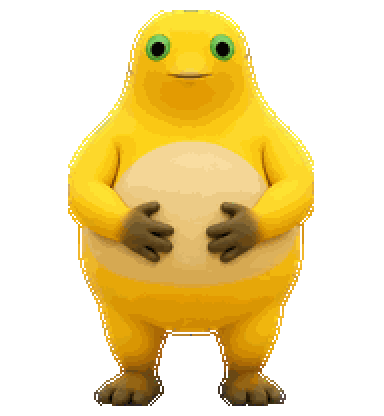
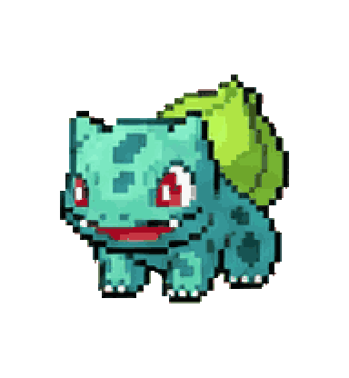
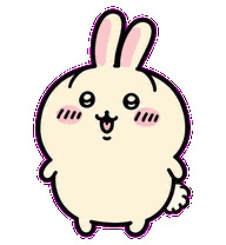
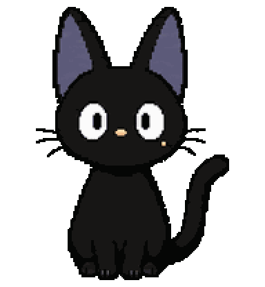

<div align="center">

# Awesome Codex Pet

[English](../../README.md) | [简体中文](../zh-CN/README.md) | [한국어](../ko/README.md) | 日本語 | [Español](../es/README.md)

<h2><a href="https://codexpet.top/ja">codexpet.top で無料のコミュニティ Codex ペットを探してインストール →</a></h2>

<p><strong>Awesome Codex Pet は、コミュニティが制作した無料の Codex ペットギャラリーです。アニメーションを確認し、リポジトリを複製せずにお気に入りをインストールできます。まだないキャラクターはコミュニティへ制作をリクエストできます。</strong></p>

<p><a href="https://codexpet.top/ja"><strong>ペットを見る</strong></a> · <a href="https://codexpet.top/ja/install"><strong>インストール</strong></a> · <a href="https://codexpet.top/ja/request"><strong>キャラクターをリクエスト</strong></a></p>

<a href="https://codexpet.top/ja"></a>

      [](https://github.com/legeling/awesome-codex-pet/actions/workflows/pet-previews.yml)

</div>

このリポジトリは [codexpet.top](https://codexpet.top/ja) のソースカタログです。インストール可能なペット、作者と出典、コレクション情報、検証ツール、貢献履歴を管理しています。

## 特徴

- **ワンコマンドでインストール** — クローンや手動設定なしで macOS / Linux / Windows に対応
- **無料コミュニティギャラリー** — アニメーション、コレクション、作者ページ、週間ランキング、いいね、共有機能
- **無料のキャラクターリクエスト** — spritesheet がなくてもキャラクターと参考資料を投稿可能。制作や採用は保証されません
- **AI ファーストの投稿フロー** — Codex でペットの制作、修正、検証、投稿が可能

各ペットは次の 3 ファイルだけで構成されます。

```text
pets/<pet-slug>--<author-slug>/
├── submission.json
├── pet.json
└── spritesheet.webp
```

`submission.json.name` は必須のフォールバック名です。翻訳名は投稿者が明示的に提供した場合のみ使用し、サイトがキャラクター名を自動翻訳することはありません。

## ペットのバージョン

| Version | Atlas               | Runtime metadata                      | 用途                               |
| ------- | ------------------- | ------------------------------------- | ---------------------------------- |
| v1      | `1536x1872`, 8 × 9  | omit `spriteVersionNumber` or set `1` | 従来の標準アニメーション           |
| v2      | `1536x2288`, 8 × 11 | `spriteVersionNumber: 2`              | 標準アニメーションと 16 方向の視線 |

## クイックインストール

リポジトリのクローンは不要です。利用するシェルに合ったコマンドを選んでください。インストーラーはマニフェストと SHA-256 を検証し、既存のパッケージを置き換える場合は `--force` を要求します。

```bash
# macOS / Linux
curl -fsSL --proto '=https' --tlsv1.2 https://raw.githubusercontent.com/legeling/awesome-codex-pet/main/scripts/install-pet.sh | bash -s -- --raw-base https://raw.githubusercontent.com/legeling/awesome-codex-pet/main firefly--lingxiaotian
```

```powershell
# Windows PowerShell
powershell -NoProfile -ExecutionPolicy Bypass -Command "iwr -UseB -MaximumRedirection 5 -TimeoutSec 120 https://raw.githubusercontent.com/legeling/awesome-codex-pet/main/scripts/install-pet.ps1 | iex; Install-CodexPet firefly--lingxiaotian -RawBase 'https://raw.githubusercontent.com/legeling/awesome-codex-pet/main'"
```

## ペット一覧

**[すべてのペットとアニメーションを見る →](https://codexpet.top/ja)**

<table width="100%">
<tr><td align="center" width="20%"><a href="https://codexpet.top/pets/firefly--lingxiaotian"><br>Firefly</a></td><td align="center" width="20%"><a href="https://codexpet.top/pets/kid-goku--julianhuang"><br>Kid Goku</a></td><td align="center" width="20%"><a href="https://codexpet.top/pets/rem--l1"><br>Rem</a></td><td align="center" width="20%"><a href="https://codexpet.top/pets/happynailong--aquaxyy"><br>大笑奶龙</a></td><td align="center" width="20%"><a href="https://codexpet.top/pets/shinchan--chenxin-dlut"><br>Shinchan</a></td></tr>
<tr><td align="center" width="20%"><a href="https://codexpet.top/pets/frieren--lingxiaotian"><br>Frieren</a></td><td align="center" width="20%"><a href="https://codexpet.top/pets/buba--yurcek"><br>Buba</a></td><td align="center" width="20%"><a href="https://codexpet.top/pets/paimon--lingxiaotian"><br>Paimon</a></td><td align="center" width="20%"><a href="https://codexpet.top/pets/usachi--jack"><br>乌萨奇</a></td><td align="center" width="20%"><a href="https://codexpet.top/pets/conan--chenxin-dlut"><br>Conan</a></td></tr>
<tr><td align="center" width="20%"><a href="https://codexpet.top/pets/furina--lingxiaotian"><br>Furina</a></td><td align="center" width="20%"><a href="https://codexpet.top/pets/doraemon--xueshi"><br>Doraemon</a></td><td align="center" width="20%"><a href="https://codexpet.top/pets/jiji--yena"><br>Jiji</a></td><td align="center" width="20%"><a href="https://codexpet.top/pets/citlali--zaytsevzy"><br>Citlali</a></td><td align="center" width="20%"><a href="https://codexpet.top/pets/miku--lingxiaotian"><br>Miku</a></td></tr>
</table>

<details>
<summary>全ペット一覧（テキストのみ） · 239</summary>

### ゲームキャラクター

<ul>
<li><a href="../../pets/firefly--lingxiaotian">Firefly</a> · 作者 <a href="https://github.com/legeling">@legeling</a> · v1</li>
<li><a href="../../pets/acheron--lingxiaotian">Acheron</a> · 作者 <a href="https://github.com/legeling">@legeling</a> · v1</li>
<li><a href="../../pets/arlecchino--lingxiaotian">Arlecchino</a> · 作者 <a href="https://github.com/legeling">@legeling</a> · v1</li>
<li><a href="../../pets/black-swan--lingxiaotian">Black Swan</a> · 作者 <a href="https://github.com/legeling">@legeling</a> · v1</li>
<li><a href="../../pets/blazer-god--sou2c1">Blazer God</a> · 作者 <a href="https://github.com/SOU2C1">@SOU2C1</a> · v1</li>
<li><a href="../../pets/buba--yurcek">Buba</a> · 作者 @yurcek · v1</li>
<li><a href="../../pets/castorice--lingxiaotian">Castorice</a> · 作者 <a href="https://github.com/legeling">@legeling</a> · v1</li>
<li><a href="../../pets/chen--chenxin-dlut">Chen</a> · 作者 <a href="https://github.com/chenxin-dlut">@chenxin-dlut</a> · v1</li>
<li><a href="../../pets/citlali--zaytsevzy">Citlali</a> · 作者 <a href="https://github.com/ZaytsevZY">@ZaytsevZY</a> · v2</li>
<li><a href="../../pets/cyrene--lingxiaotian">Cyrene</a> · 作者 <a href="https://github.com/legeling">@legeling</a> · v1</li>
<li><a href="../../pets/dimo-stand--god-wu">Dimo</a> · 作者 @god-wu · v1</li>
<li><a href="../../pets/doro--lingxiaotian">Doro</a> · 作者 <a href="https://github.com/legeling">@legeling</a> · v1</li>
<li><a href="../../pets/doro--vaevie">Doro</a> · 作者 <a href="https://github.com/vaevie">@vaevie</a> · v2</li>
<li><a href="../../pets/feixiao--lingxiaotian">Feixiao</a> · 作者 <a href="https://github.com/legeling">@legeling</a> · v1</li>
<li><a href="../../pets/furina--lingxiaotian">Furina</a> · 作者 <a href="https://github.com/legeling">@legeling</a> · v1</li>
<li><a href="../../pets/ganyu--chenxin-dlut">Ganyu</a> · 作者 <a href="https://github.com/chenxin-dlut">@chenxin-dlut</a> · v1</li>
<li><a href="../../pets/hu-tao--lingxiaotian">Hu Tao</a> · 作者 <a href="https://github.com/legeling">@legeling</a> · v1</li>
<li><a href="../../pets/hyacine--kurisu">Hyacine</a> · 作者 <a href="https://github.com/kurisu994">@kurisu994</a> · v2</li>
<li><a href="../../pets/isaac--foggy-whale">Isaac</a> · 作者 <a href="https://github.com/Foggy-whale">@Foggy-whale</a> · v2</li>
<li><a href="../../pets/kamisato-ayaka--lingxiaotian">Kamisato Ayaka</a> · 作者 <a href="https://github.com/legeling">@legeling</a> · v1</li>
<li><a href="../../pets/klee--chenxin-dlut">Klee</a> · 作者 <a href="https://github.com/chenxin-dlut">@chenxin-dlut</a> · v1</li>
<li><a href="../../pets/klee-desk--ayanxu56-boop">KleeDesk</a> · 作者 <a href="https://github.com/ayanxu56-boop">@ayanxu56-boop</a> · v2</li>
<li><a href="../../pets/kuro-chibi--kuroneko-night">Kuro Chibi</a> · 作者 <a href="https://github.com/KuroNeko-night">@KuroNeko-night</a> · v2</li>
<li><a href="../../pets/lappland--chenxin-dlut">Lappland</a> · 作者 <a href="https://github.com/chenxin-dlut">@chenxin-dlut</a> · v1</li>
<li><a href="../../pets/little-black-mage--libertis">Little Black Mage</a> · 作者 @libertis · v1</li>
<li><a href="../../pets/march-7th--chenxin-dlut">March 7th</a> · 作者 <a href="https://github.com/chenxin-dlut">@chenxin-dlut</a> · v1</li>
<li><a href="../../pets/marisa-kirisame--eigentom">Marisa Kirisame</a> · 作者 <a href="https://github.com/EigenTom">@eigentom</a> · v2</li>
<li><a href="../../pets/missile--zpzjzj">Missile</a> · 作者 <a href="https://github.com/zpzjzj">@zpzjzj</a> · v2</li>
<li><a href="../../pets/miyabi--eric-terminal">Miyabi</a> · 作者 <a href="https://codex-pets.net/users/eric-terminal">@eric-terminal</a> · v1</li>
<li><a href="../../pets/nahida--lingxiaotian">Nahida</a> · 作者 <a href="https://github.com/legeling">@legeling</a> · v1</li>
<li><a href="../../pets/navia--lingxiaotian">Navia</a> · 作者 <a href="https://github.com/legeling">@legeling</a> · v1</li>
<li><a href="../../pets/om-nom--kasyan1337">Om Nom</a> · 作者 <a href="https://github.com/kasyan1337">@kasyan1337</a> · v2</li>
<li><a href="../../pets/paimon--lingxiaotian">Paimon</a> · 作者 <a href="https://github.com/legeling">@legeling</a> · v1</li>
<li><a href="../../pets/phoebe--chenxin-dlut">Phoebe</a> · 作者 <a href="https://github.com/chenxin-dlut">@chenxin-dlut</a> · v1</li>
<li><a href="../../pets/raiden-shogun--lingxiaotian">Raiden Shogun</a> · 作者 <a href="https://github.com/legeling">@legeling</a> · v1</li>
<li><a href="../../pets/reimu--lingxiaotian">Reimu</a> · 作者 <a href="https://github.com/legeling">@legeling</a> · v1</li>
<li><a href="../../pets/remielle-dan--erlla">Remielle-Dan / Leimi</a> · 作者 <a href="https://github.com/Erlla">@Erlla</a> · v2</li>
<li><a href="../../pets/robin--lingxiaotian">Robin</a> · 作者 <a href="https://github.com/legeling">@legeling</a> · v1</li>
<li><a href="../../pets/rosmontis--flovst">Rosmontis</a> · 作者 @flovst · v2</li>
<li><a href="../../pets/ruan-mei--lingxiaotian">Ruan Mei</a> · 作者 <a href="https://github.com/legeling">@legeling</a> · v1</li>
<li><a href="../../pets/silver-wolf--lingxiaotian">Silver Wolf</a> · 作者 <a href="https://github.com/legeling">@legeling</a> · v1</li>
<li><a href="../../pets/sonetto--chenxin-dlut">Sonetto</a> · 作者 <a href="https://github.com/chenxin-dlut">@chenxin-dlut</a> · v1</li>
<li><a href="../../pets/sparkle--lingxiaotian">Sparkle</a> · 作者 <a href="https://github.com/legeling">@legeling</a> · v1</li>
<li><a href="../../pets/susuta--xiangzi529">Susuta</a> · 作者 <a href="https://github.com/Xiangzi529">@Xiangzi529</a> · v2</li>
<li><a href="../../pets/tingyun--lingxiaotian">Tingyun</a> · 作者 <a href="https://github.com/legeling">@legeling</a> · v1</li>
<li><a href="../../pets/vertin--chenxin-dlut">Vertin</a> · 作者 <a href="https://github.com/chenxin-dlut">@chenxin-dlut</a> · v1</li>
<li><a href="../../pets/yoimiya--chenxin-dlut">Yoimiya</a> · 作者 <a href="https://github.com/chenxin-dlut">@chenxin-dlut</a> · v1</li>
<li><a href="../../pets/zani--chenxin-dlut">Zani</a> · 作者 <a href="https://github.com/chenxin-dlut">@chenxin-dlut</a> · v1</li>
<li><a href="../../pets/yae-miko--legeling">八重神子</a> · 作者 <a href="https://github.com/legeling">@legeling</a> · v2</li>
<li><a href="../../pets/dnf-female-ammo--qunboo">女弹药Q</a> · 作者 <a href="https://github.com/QunBoo">@QunBoo</a> · v1</li>
<li><a href="../../pets/wukong--jorge-cuevas90003">悟空</a> · 作者 <a href="https://github.com/Jorge-Cuevas90003">@Jorge-Cuevas90003</a> · v2</li>
<li><a href="../../pets/doudizhu-laonongmin--chenyijing131-art">斗地主老农民</a> · 作者 <a href="https://github.com/chenyijing131-art">@chenyijing131-art</a> · v2</li>
<li><a href="../../pets/new-covenant-exusiai--chenxin-dlut">新约能天使</a> · 作者 <a href="https://github.com/chenxin-dlut">@chenxin-dlut</a> · v1</li>
<li><a href="../../pets/regulus-star-antimony--chenxin-dlut">星锑</a> · 作者 <a href="https://github.com/chenxin-dlut">@chenxin-dlut</a> · v1</li>
<li><a href="../../pets/lin-pianpian-first-meeting--legeling">林翩翩（初遇）</a> · 作者 <a href="https://github.com/legeling">@legeling</a> · v2</li>
<li><a href="../../pets/lin-pianpian-date--legeling">林翩翩（约会）</a> · 作者 <a href="https://github.com/legeling">@legeling</a> · v2</li>
<li><a href="../../pets/lin-pianpian-flower-street--legeling">林翩翩（花街）</a> · 作者 <a href="https://github.com/legeling">@legeling</a> · v2</li>
<li><a href="../../pets/lin-pianpian-courtesan--legeling">林翩翩（花魁）</a> · 作者 <a href="https://github.com/legeling">@legeling</a> · v2</li>
<li><a href="../../pets/shen-xinghui--legeling">沈星回</a> · 作者 <a href="https://github.com/legeling">@legeling</a> · v2</li>
<li><a href="../../pets/chillet--legeling">疾旋鼬</a> · 作者 <a href="https://github.com/legeling">@legeling</a> · v2</li>
<li><a href="../../pets/arona--legeling">阿罗那</a> · 作者 <a href="https://github.com/legeling">@legeling</a> · v2</li>
<li><a href="../../pets/youmu--ai-generated">魂魄妖梦</a> · 作者 @ai-generated · v2</li>
</ul>

### アニメキャラクター

<ul>
<li><a href="../../pets/zero-two--mingqingmozhao">02</a> · 作者 @mingqingmozhao · v1</li>
<li><a href="../../pets/anya--chenxin-dlut">Anya</a> · 作者 <a href="https://github.com/chenxin-dlut">@chenxin-dlut</a> · v1</li>
<li><a href="../../pets/asuka--maxg24">Asuka</a> · 作者 <a href="https://codex-pets.net/users/maxg24">@maxg24</a> · v1</li>
<li><a href="../../pets/chibi-rei-pet--bendy">Chibi Rei Pet</a> · 作者 @Bendy · v1</li>
<li><a href="../../pets/chotu--makriman">Chotu</a> · 作者 <a href="https://github.com/makriman">@makriman</a> · v2</li>
<li><a href="../../pets/conan--chenxin-dlut">Conan</a> · 作者 <a href="https://github.com/chenxin-dlut">@chenxin-dlut</a> · v1</li>
<li><a href="../../pets/doraemon--xueshi">Doraemon</a> · 作者 <a href="https://codex-pets.net/users/xueshi">@xueshi</a> · v1</li>
<li><a href="../../pets/elaina--nyakku-shigure">Elaina</a> · 作者 <a href="https://codex-pets.net/users/nyakku-shigure">@nyakku-shigure</a> · v1</li>
<li><a href="../../pets/eren--ash-sw">Eren</a> · 作者 <a href="https://codex-pets.net/users/ash-sw">@ash-sw</a> · v1</li>
<li><a href="../../pets/fang-yuan--kelleszzz">Fang Yuan</a> · 作者 <a href="https://github.com/kelleszzz">@kelleszzz</a> · v2</li>
<li><a href="../../pets/frieren--lingxiaotian">Frieren</a> · 作者 <a href="https://github.com/legeling">@legeling</a> · v1</li>
<li><a href="../../pets/zhuzhuxia--ryde-play">GG Bond</a> · 作者 <a href="https://github.com/RYDE-PLAY">@RYDE-PLAY</a> · v2</li>
<li><a href="../../pets/gojo--lilokhalikfa">Gojo</a> · 作者 <a href="https://codex-pets.net/users/lilokhalikfa">@lilokhalikfa</a> · v1</li>
<li><a href="../../pets/han-li--metro186">Han Li</a> · 作者 <a href="https://github.com/metro186">@metro186</a> · v2</li>
<li><a href="../../pets/ikaros--icarus-alpha">Ikaros</a> · 作者 <a href="https://codex-pets.net/users/icarus-alpha">@icarus-alpha</a> · v1</li>
<li><a href="../../pets/isekaijoucho--siiverash">Isekaijoucho</a> · 作者 <a href="https://github.com/SiIverAsh">@SiIverAsh</a> · v1</li>
<li><a href="../../pets/jolyne-cujoh--d2682787206-sys">Jolyne Cujoh</a> · 作者 <a href="https://github.com/d2682787206-sys">@d2682787206-sys</a> · v2</li>
<li><a href="../../pets/kaguya-luna--enclairfarron">Kaguya Luna</a> · 作者 <a href="https://github.com/enclairfarron">@enclairfarron</a> · v2</li>
<li><a href="../../pets/kaiju-no-8--terry878">Kaiju No. 8</a> · 作者 @TERRY878 · v2</li>
<li><a href="../../pets/kid--chenxin-dlut">Kid</a> · 作者 <a href="https://github.com/chenxin-dlut">@chenxin-dlut</a> · v1</li>
<li><a href="../../pets/kid-goku--julianhuang">Kid Goku</a> · 作者 <a href="https://codex-pets.net/users/julianhuang">@julianhuang</a> · v1</li>
<li><a href="../../pets/levi--emrecb">Levi</a> · 作者 <a href="https://codex-pets.net/users/emrecb">@emrecb</a> · v1</li>
<li><a href="../../pets/light-fury--legeling">Light Fury</a> · 作者 <a href="https://github.com/legeling">@legeling</a> · v2</li>
<li><a href="../../pets/luffy-gear-5--jordsshmords1">Luffy Gear 5</a> · 作者 <a href="https://codex-pets.net/users/jordsshmords1">@jordsshmords1</a> · v1</li>
<li><a href="../../pets/mahiro--lingxiaotian">Mahiro</a> · 作者 <a href="https://github.com/legeling">@legeling</a> · v1</li>
<li><a href="../../pets/makima-coat--yuyuabc1">Makima (Coat)</a> · 作者 <a href="https://github.com/yuyuabc1">@yuyuabc1</a> · v2</li>
<li><a href="../../pets/makimamini--1sh1ro">MakimaMini</a> · 作者 @1sh1ro · v1</li>
<li><a href="../../pets/makisekurisu--m1gr4ine">Makise Kurisu</a> · 作者 @m1gr4ine · v1</li>
<li><a href="../../pets/mihari--hyoni1129">Mihari</a> · 作者 <a href="https://github.com/Hyoni1129">@Hyoni1129</a> · v1</li>
<li><a href="../../pets/mikoto--lingxiaotian">Mikoto</a> · 作者 <a href="https://github.com/legeling">@legeling</a> · v1</li>
<li><a href="../../pets/miku--lingxiaotian">Miku</a> · 作者 <a href="https://github.com/legeling">@legeling</a> · v1</li>
<li><a href="../../pets/misaka-network--ldl1234">Misaka Network</a> · 作者 <a href="https://github.com/ldl1234">@ldl1234</a> · v2</li>
<li><a href="../../pets/nimbus--soraberu">Nimbus</a> · 作者 <a href="https://codex-pets.net/users/soraberu">@soraberu</a> · v1</li>
<li><a href="../../pets/rem--l1">Rem</a> · 作者 <a href="https://codex-pets.net/users/l1">@l1</a> · v1</li>
<li><a href="../../pets/rinami--siiverash">Rinami Himesaki</a> · 作者 <a href="https://github.com/SiIverAsh">@SiIverAsh</a> · v1</li>
<li><a href="../../pets/roxy-pixel--gravity">Roxy Pixel</a> · 作者 @gravity · v1</li>
<li><a href="../../pets/saber--petdex-zhenyou-ling">Saber</a> · 作者 @真宵 绫. · v1</li>
<li><a href="../../pets/saiki-kusuo--yjt0416">Saiki Kusuo</a> · 作者 <a href="https://github.com/yjt0416">@yjt0416</a> · v1</li>
<li><a href="../../pets/sakamoto--zpzjzj">Sakamoto</a> · 作者 <a href="https://github.com/zpzjzj">@zpzjzj</a> · v2</li>
<li><a href="../../pets/gintoki-pixel--yuu-m">Sakata Gintoki</a> · 作者 @Yuu M. · v1</li>
<li><a href="../../pets/shinchan--chenxin-dlut">Shinchan</a> · 作者 <a href="https://github.com/chenxin-dlut">@chenxin-dlut</a> · v1</li>
<li><a href="../../pets/takamatsu-tomori--a1wace-dev">Takamatsu Tomori</a> · 作者 @A1wace-dev · v2</li>
<li><a href="../../pets/togawa-sakiko--enclairfarron">Togawa Sakiko</a> · 作者 <a href="https://github.com/enclairfarron">@enclairfarron</a> · v2</li>
<li><a href="../../pets/toothless--legeling">Toothless</a> · 作者 <a href="https://github.com/legeling">@legeling</a> · v2</li>
<li><a href="../../pets/toyama-kasumi--lsmd23">Toyama Kasumi</a> · 作者 <a href="https://github.com/lsmd23">@lsmd23</a> · v2</li>
<li><a href="../../pets/violet--lazenca">Violet</a> · 作者 <a href="https://codex-pets.net/users/lazenca">@lazenca</a> · v1</li>
<li><a href="../../pets/wakaba-mutsumi--carambola">Wakaba Mutsumi</a> · 作者 @Carambola · v2</li>
<li><a href="../../pets/inosuke-hashibira--wangfan002">伊之助 Q版 丰富动作</a> · 作者 @wangfan002 · v1</li>
<li><a href="../../pets/nangong-wan--bpup">南宫婉</a> · 作者 <a href="https://github.com/bpup">@bpup</a> · v2</li>
<li><a href="../../pets/zenitsu-agatsuma--wangfan002">善逸 Q版 丰富动作</a> · 作者 @wangfan002 · v1</li>
<li><a href="../../pets/giyu-tomioka--wangfan002">富冈义勇 Q版 丰富动作</a> · 作者 @wangfan002 · v1</li>
<li><a href="../../pets/muichiro-tokito--wangfan002">时透无一郎 Q版 空灵动作</a> · 作者 @wangfan002 · v1</li>
<li><a href="../../pets/tanjiro-kamado--wangfan002">炭治郎 Q版 丰富动作</a> · 作者 @wangfan002 · v1</li>
<li><a href="../../pets/nezuko-kamado--wangfan002">祢豆子 Q版 丰富动作</a> · 作者 @wangfan002 · v1</li>
<li><a href="../../pets/luo-xiaohei--legeling">罗小黑</a> · 作者 <a href="https://github.com/legeling">@legeling</a> · v2</li>
<li><a href="../../pets/fujiwara-chika--klmklmnb">藤原千花</a> · 作者 <a href="https://github.com/klmklmnb">@klmklmnb</a> · v2</li>
<li><a href="../../pets/shinobu-kocho--wangfan002">蝴蝶忍 Q版 华丽动作</a> · 作者 @wangfan002 · v1</li>
<li><a href="../../pets/han-li--legeling">韩立</a> · 作者 <a href="https://github.com/legeling">@legeling</a> · v2</li>
<li><a href="../../pets/bocchi--lingxiaotian">Bocchi</a> · 作者 <a href="https://github.com/legeling">@legeling</a> · v1</li>
</ul>

### オリジナルキャラクター

<ul>
<li><a href="../../pets/aiko--chenxin-dlut">Aiko</a> · 作者 <a href="https://github.com/chenxin-dlut">@chenxin-dlut</a> · v1</li>
<li><a href="../../pets/chud-codex--jorge-cuevas90003">Chud Codex</a> · 作者 <a href="https://github.com/Jorge-Cuevas90003">@Jorge-Cuevas90003</a> · v2</li>
<li><a href="../../pets/codexy--z19t">Codexy</a> · 作者 <a href="https://github.com/z19t">@z19t</a> · v2</li>
<li><a href="../../pets/diana--am">Diana</a> · 作者 @am · v1</li>
<li><a href="../../pets/hajimi--zeyuwang1999">Hajimi</a> · 作者 <a href="https://github.com/zeyuwang1999">@zeyuwang1999</a> · v1</li>
<li><a href="../../pets/hamo--haipengzzz">Hamo</a> · 作者 <a href="https://github.com/haipengzzz">@haipengzzz</a> · v2</li>
<li><a href="../../pets/hana2--initiatione">Hana2</a> · 作者 <a href="https://github.com/initiatione">@initiatione</a> · v1</li>
<li><a href="../../pets/iris--yau-427">Iris</a> · 作者 <a href="https://github.com/Yau-427">@Yau-427</a> · v2</li>
<li><a href="../../pets/jesse-the-fox--itjesse">JesseTheFox</a> · 作者 <a href="https://github.com/ITJesse">@ITJesse</a> · v2</li>
<li><a href="../../pets/joker--oytyo">Joker</a> · 作者 @oytyo · v2</li>
<li><a href="../../pets/linnea--nyakku-shigure">Linnea</a> · 作者 @nyakku-shigure · v1</li>
<li><a href="../../pets/lumei--dagwbl">Lumei</a> · 作者 <a href="https://github.com/Dagwbl">@Dagwbl</a> · v2</li>
<li><a href="../../pets/mika--rotl24">Mika</a> · 作者 <a href="https://github.com/ROTl24">@ROTl24</a> · v1</li>
<li><a href="../../pets/minty--somnusochi">Minty</a> · 作者 <a href="https://github.com/Somnusochi">@Somnusochi</a> · v2</li>
<li><a href="../../pets/ruruka--ltmcliao-cmyk">RuRuKa</a> · 作者 <a href="https://github.com/ltmcliao-cmyk">@ltmcliao-cmyk</a> · v1</li>
<li><a href="../../pets/shian-helper--mistyshen">Shian</a> · 作者 <a href="https://github.com/mistyShen">@mistyShen</a> · v1</li>
<li><a href="../../pets/warden-codex--jorge-cuevas90003">Warden Codex</a> · 作者 <a href="https://github.com/Jorge-Cuevas90003">@Jorge-Cuevas90003</a> · v2</li>
<li><a href="../../pets/yier--gbn666">Yi Er</a> · 作者 <a href="https://github.com/gbn666">@gbn666</a> · v1</li>
<li><a href="../../pets/yume-boundary--andy-meow">Yume</a> · 作者 @andy-meow · v1</li>
<li><a href="../../pets/yuzubou--keseras34938976">Yuzubou</a> · 作者 <a href="https://github.com/Keseras34938976">@Keseras34938976</a> · v1</li>
<li><a href="../../pets/gudong--rank">咕咚</a> · 作者 @Rank · v2</li>
<li><a href="../../pets/liubao--killyer">榴宝</a> · 作者 @killyer · v2</li>
<li><a href="../../pets/feibi--vanfff">菲比</a> · 作者 @vanfff · v1</li>
</ul>

### マスコット

<ul>
<li><a href="../../pets/aemeath-mini--cunuo">Aemeath Mini</a> · 作者 <a href="https://github.com/cuNuo">@cuNuo</a> · v1</li>
<li><a href="../../pets/apu--xchangee">Apu</a> · 作者 <a href="https://github.com/xchangee">@xchangee</a> · v1</li>
<li><a href="../../pets/claude--xiangking">Claude</a> · 作者 <a href="https://github.com/xiangking">@xiangking</a> · v1</li>
<li><a href="../../pets/twinkle-twinkle--twinkletwinkle">Dashun&#39;s Twinkle Twinkle</a> · 作者 @twinkletwinkle · v1</li>
<li><a href="../../pets/diaoyi-baobao--d1a0y1bb">Diaoyi Baobao</a> · 作者 <a href="https://github.com/D1a0y1bb">@D1a0y1bb</a> · v1</li>
<li><a href="../../pets/gpt-muse--opask">GPT-muse</a> · 作者 @opask · v1</li>
<li><a href="../../pets/lulu--yogazz">Lulu</a> · 作者 <a href="https://github.com/YoGazz">@YoGazz</a> · v1</li>
<li><a href="../../pets/saki--rookie-09">Saki</a> · 作者 <a href="https://github.com/rookie-09">@rookie-09</a> · v1</li>
<li><a href="../../pets/serge-le-lapin--legeling">Serge le Lapin</a> · 作者 <a href="https://github.com/legeling">@legeling</a> · v2</li>
<li><a href="../../pets/sleepwing--lttxzmj">Sleepwing</a> · 作者 <a href="https://github.com/lttxzmj">@lttxzmj</a> · v2</li>
<li><a href="../../pets/wally--wally025">Wally</a> · 作者 <a href="https://github.com/wally025">@wally025</a> · v1</li>
<li><a href="../../pets/zhengyin--noonwake">Zhengyin</a> · 作者 <a href="https://pets.usefulmint.com/?utm_source=awesome_codex_pet&utm_medium=directory&utm_campaign=founding_five&utm_content=zhengyin_listing">@noonwake-ai</a> · v2</li>
<li><a href="../../pets/happynailong--aquaxyy">大笑奶龙</a> · 作者 @aquaxyy · v1</li>
<li><a href="../../pets/bubu-codebrew-bear--xxhh0822">布布</a> · 作者 <a href="https://github.com/xxhh0822">@xxhh0822</a> · v2</li>
</ul>

### 動物の仲間

<ul>
<li><a href="../../pets/becky--natewanggg">Becky</a> · 作者 <a href="https://github.com/NateWanggg">@NateWanggg</a> · v1</li>
<li><a href="../../pets/bubu--gbn666">Bubu</a> · 作者 <a href="https://github.com/gbn666">@gbn666</a> · v1</li>
<li><a href="../../pets/corgi-companion--cxian0928-afk">Corgi Companion</a> · 作者 <a href="https://github.com/cxian0928-afk">@cxian0928-afk</a> · v1</li>
<li><a href="../../pets/desk-otter--zihualiu1997">Desk Otter</a> · 作者 <a href="https://github.com/zihualiu1997">@zihualiu1997</a> · v1</li>
<li><a href="../../pets/diandian--lllucasxu">Diandian</a> · 作者 <a href="https://github.com/LLLucasXU">@LLLucasXU</a> · v1</li>
<li><a href="../../pets/dudu-bubu--clembuilds">Dudu &amp; Bubu</a> · 作者 @clembuilds · v1</li>
<li><a href="../../pets/ella-wave--sehjk">Ella Wave</a> · 作者 @sehjk · v1</li>
<li><a href="../../pets/fleta--natewanggg">Fleta</a> · 作者 <a href="https://github.com/NateWanggg">@NateWanggg</a> · v1</li>
<li><a href="../../pets/frankie--aygunvarol">Frankie</a> · 作者 <a href="https://github.com/AygunVarol">@AygunVarol</a> · v1</li>
<li><a href="../../pets/jiji--yena">Jiji</a> · 作者 @yena · v1</li>
<li><a href="../../pets/kiko--untko">Kiko</a> · 作者 <a href="https://github.com/untko">@untko</a> · v2</li>
<li><a href="../../pets/kimoju--andiac">Kimoju</a> · 作者 @andiac · v2</li>
<li><a href="../../pets/lil-swole--gg0805">Lil Swole</a> · 作者 <a href="https://github.com/gg0805">@gg0805</a> · v2</li>
<li><a href="../../pets/little-sheep--mingdong">Little Sheep</a> · 作者 @MingDong · v1</li>
<li><a href="../../pets/mai--dwdestiny">Mai</a> · 作者 <a href="https://github.com/DwDestiny">@DwDestiny</a> · v1</li>
<li><a href="../../pets/mellow-duck--sally-entr">Mellow Duck</a> · 作者 @sally-entr · v1</li>
<li><a href="../../pets/mimi--spacebody">Mimi</a> · 作者 <a href="https://github.com/Spacebody">@Spacebody</a> · v1</li>
<li><a href="../../pets/moomew-coder-cat--ping">MooMew Coder</a> · 作者 @ping · v1</li>
<li><a href="../../pets/panda--jason-bai">Panda</a> · 作者 <a href="https://github.com/Jason-Bai">@Jason-Bai</a> · v1</li>
<li><a href="../../pets/pixel-duck--flamurmaliqi">Pixel Duck</a> · 作者 <a href="https://github.com/FlamurMaliqi">@FlamurMaliqi</a> · v1</li>
<li><a href="../../pets/rook--klubbyte">Rook</a> · 作者 @klubbyte · v1</li>
<li><a href="../../pets/miu-meo--lemon-z">SalaryCat</a> · 作者 @lemon-z · v2</li>
<li><a href="../../pets/salary-cat--zuochunjie">SalaryCat</a> · 作者 <a href="https://github.com/Zuochunjie">@Zuochunjie</a> · v2</li>
<li><a href="../../pets/shaun--ryde-play">Shaun the Sheep</a> · 作者 <a href="https://github.com/RYDE-PLAY">@RYDE-PLAY</a> · v2</li>
<li><a href="../../pets/sunny-retriever--legeling">Sunny Retriever</a> · 作者 <a href="https://github.com/legeling">@legeling</a> · v2</li>
<li><a href="../../pets/teddy--danieloleary">Teddy</a> · 作者 <a href="https://github.com/danieloleary">@danieloleary</a> · v1</li>
<li><a href="../../pets/tian-hua-hua--d1a0y1bb">Tian Hua Hua</a> · 作者 <a href="https://github.com/D1a0y1bb">@D1a0y1bb</a> · v1</li>
<li><a href="../../pets/usachi--jack">乌萨奇</a> · 作者 @jack · v1</li>
<li><a href="../../pets/yuanbao--legeling">元宝</a> · 作者 <a href="https://github.com/legeling">@legeling</a> · v2</li>
<li><a href="../../pets/dai-dai-nai-you--1wphantom">呆呆奶油</a> · 作者 @1wphantom · v2</li>
<li><a href="../../pets/tuantuan--jbbom">团团</a> · 作者 <a href="https://github.com/JbBom">@JbBom</a> · v1</li>
<li><a href="../../pets/duodong--froggie">多栋</a> · 作者 @froggie · v1</li>
<li><a href="../../pets/naiwa--sandytruant">奶蛙</a> · 作者 <a href="https://github.com/sandytruant">@sandytruant</a> · v2</li>
<li><a href="../../pets/xiaoba-cat--jack">小八猫</a> · 作者 @jack · v1</li>
<li><a href="../../pets/xiaomai--brian-3">小麦 XiaoMai</a> · 作者 @brian-3 · v2</li>
<li><a href="../../pets/koukou-penguin--hoody">扣扣企鹅</a> · 作者 @hoody · v2</li>
<li><a href="../../pets/capybara-lulu--jiushu">水豚噜噜</a> · 作者 @jiushu · v1</li>
<li><a href="../../pets/niumou--jarvis-2">牛哞</a> · 作者 @jarvis-2 · v2</li>
<li><a href="../../pets/zichao-xiong--z-kzhang">自嘲熊</a> · 作者 @z-kzhang · v1</li>
<li><a href="../../pets/jinmao--legeling">金毛</a> · 作者 <a href="https://github.com/legeling">@legeling</a> · v2</li>
<li><a href="../../pets/wucanrou--ch">金渐层（午餐肉）</a> · 作者 <a href="https://github.com/huanchu0213-ui">@huanchu0213-ui</a> · v2</li>
</ul>

### ファンタジー生物

<ul>
<li><a href="../../pets/behemoth--kajdrak2">Behemoth</a> · 作者 <a href="https://github.com/Kajdrak2">@Kajdrak2</a> · v2</li>
<li><a href="../../pets/goblin--rkwap">Goblin</a> · 作者 @rkwap · v1</li>
<li><a href="../../pets/luna-angel-cat--neve">luna_angel cat</a> · 作者 @neve · v2</li>
<li><a href="../../pets/night-neko--netizenxuan">Night Neko</a> · 作者 <a href="https://github.com/netizenXuan">@netizenXuan</a> · v1</li>
<li><a href="../../pets/starcorn--alterhq">Starcorn</a> · 作者 <a href="https://github.com/alterhq">@alterhq</a> · v1</li>
<li><a href="../../pets/xian-xiao-lu--qingyunagi">Xian Xiao Lu</a> · 作者 <a href="https://github.com/qingyunAGI">@qingyunAGI</a> · v1</li>
<li><a href="../../pets/yuanzai--gaming33">Yuanzai</a> · 作者 <a href="https://github.com/Gaming33">@Gaming33</a> · v1</li>
</ul>

### ロボット

<ul>
<li><a href="../../pets/chispa--giiilberto-nm">Chispa</a> · 作者 @giiilberto-nm · v1</li>
<li><a href="../../pets/codenono--dq02">CodeNoNo</a> · 作者 <a href="https://github.com/Dqd02">@Dqd02</a> · v1</li>
<li><a href="../../pets/crt-monitor--wxy">CRT Monitor</a> · 作者 @wxy · v2</li>
<li><a href="../../pets/xiaoda--legeling">小达</a> · 作者 <a href="https://github.com/legeling">@legeling</a> · v2</li>
</ul>

### 人物アバター

<ul>
<li><a href="../../pets/azuma--tairazuma">Azuma</a> · 作者 @tairazuma · v1</li>
<li><a href="../../pets/tangdouren--carl312">Tangdouren</a> · 作者 <a href="https://github.com/Carl-312">@Carl-312</a> · v1</li>
<li><a href="../../pets/guga--circus">咕嘎</a> · 作者 @circus · v1</li>
<li><a href="../../pets/fengge--qzl1-stack">峰哥</a> · 作者 <a href="https://github.com/qzl1-stack">@qzl1-stack</a> · v1</li>
<li><a href="../../pets/xiang-an--legeling">翔安</a> · 作者 <a href="https://github.com/legeling">@legeling</a> · v2</li>
</ul>

### ミーム

<ul>
<li><a href="../../pets/drill-cat--qimi">Drill Cat</a> · 作者 <a href="https://github.com/qishichuan">@qishichuan</a> · v2</li>
<li><a href="../../pets/hami--tat">Hami</a> · 作者 <a href="https://github.com/TATcc">@TATcc</a> · v2</li>
<li><a href="../../pets/katana-cheems--thankyou-cheems">Katana Cheems</a> · 作者 <a href="https://github.com/Thankyou-Cheems">@Thankyou-Cheems</a> · v1</li>
<li><a href="../../pets/pickle-rick--ryde-play">Pickle Rick</a> · 作者 <a href="https://github.com/RYDE-PLAY">@RYDE-PLAY</a> · v2</li>
<li><a href="../../pets/hance-woniu--korn">旱厕蜗牛</a> · 作者 @korn · v2</li>
<li><a href="../../pets/niulai--legeling">牛来</a> · 作者 <a href="https://github.com/legeling">@legeling</a> · v2</li>
<li><a href="../../pets/niulaima--ryde-play">牛来妈</a> · 作者 <a href="https://github.com/RYDE-PLAY">@RYDE-PLAY</a> · v2</li>
<li><a href="../../pets/maodie--octane0411">耄耋</a> · 作者 <a href="https://github.com/Octane0411">@Octane0411</a> · v2</li>
</ul>

### オブジェクトと小道具

<ul>
<li><a href="../../pets/spellbook--seymour">Spellbook</a> · 作者 @seymour · v1</li>
<li><a href="../../pets/tiny-crt--chochou">Tiny CRT</a> · 作者 @chochou · v1</li>
</ul>

### その他

<ul>
<li><a href="../../pets/agamemnon--kazecreator">Agamemnon</a> · 作者 <a href="https://github.com/kazecreator">@kazecreator</a> · v2</li>
<li><a href="../../pets/deepseek-girl--legeling">DeepSeek Girl</a> · 作者 <a href="https://github.com/legeling">@legeling</a> · v2</li>
<li><a href="../../pets/sylas-ravenshade--legeling">Sylas Ravenshade</a> · 作者 <a href="https://github.com/legeling">@legeling</a> · v2</li>
<li><a href="../../pets/templar-knight--jorge-cuevas90003">Templar Knight</a> · 作者 <a href="https://github.com/Jorge-Cuevas90003">@Jorge-Cuevas90003</a> · v2</li>
<li><a href="../../pets/march-7th--legeling">三月七</a> · 作者 <a href="https://github.com/legeling">@legeling</a> · v2</li>
<li><a href="../../pets/kuromi--legeling">库洛米</a> · 作者 <a href="https://github.com/legeling">@legeling</a> · v2</li>
<li><a href="../../pets/wo-de-dao-dun--legeling">我的刀盾</a> · 作者 <a href="https://github.com/legeling">@legeling</a> · v2</li>
<li><a href="../../pets/xingxingren--legeling">星星人</a> · 作者 <a href="https://github.com/legeling">@legeling</a> · v2</li>
<li><a href="../../pets/izumi-konata--legeling">泉此方</a> · 作者 <a href="https://github.com/legeling">@legeling</a> · v2</li>
<li><a href="../../pets/yanlingji--jorge-cuevas90003">焰灵姬</a> · 作者 <a href="https://github.com/Jorge-Cuevas90003">@Jorge-Cuevas90003</a> · v2</li>
<li><a href="../../pets/yao-true-self-hertz--legeling">瑶-真我赫兹</a> · 作者 <a href="https://github.com/legeling">@legeling</a> · v2</li>
<li><a href="../../pets/twilight-sparkle--wuye3790">紫悦</a> · 作者 <a href="https://github.com/WuYe3790">@WuYe3790</a> · v2</li>
<li><a href="../../pets/longying--legeling">胧萤</a> · 作者 <a href="https://github.com/legeling">@legeling</a> · v2</li>
<li><a href="../../pets/bond-forger--legeling">邦德·福杰</a> · 作者 <a href="https://github.com/legeling">@legeling</a> · v2</li>
</ul>

</details>

## リクエストと投稿

欲しいキャラクターが見つからない場合は、無料のコミュニティリクエストを送信できます。自分のペットを投稿する場合は、最終パッケージを 3 ファイルだけにし、`npm run validate:pr` と `npm run lint` を実行してください。

- [Codex pet request](https://codexpet.top/ja/request)
- [Contribution guide](https://codexpet.top/guide)
- [`.agents/skills/submit-codex-pet`](../../.agents/skills/submit-codex-pet)

## ドキュメント

- English: [docs/en](../en)
- 简体中文: [docs/zh-CN](../zh-CN)
- 한국어: [docs/ko](../ko)
- 日本語: [docs/ja](../ja)
- Español: [docs/es](../es)

## ライセンス

- コードとスクリプト: [MIT](../../LICENSE)
- ペット素材と生成プレビュー: [CC BY-NC 4.0](../../ASSETS-LICENSE.md), unless a pet package states otherwise
