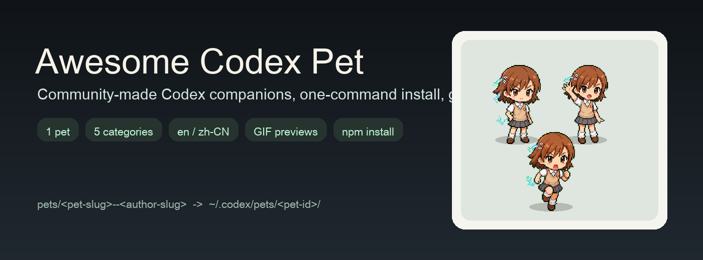

<div align="center">

# Awesome Codex Pet

简体中文 | [English](../../README.md)

      [](https://github.com/legeling/awesome-codex-pet/actions/workflows/pet-previews.yml)



</div>

一个收集社区 Codex 小宠物的精选画廊，自动生成动作预览，并支持一条命令快速安装。

每个 pet 都是一个很小的可分享包：

```text
pets/<pet-slug>--<author-slug>/
├── submission.json
├── pet.json
└── spritesheet.webp
```

pet 目录只放最终成品文件。预览图会自动生成到 `assets/previews/<pet-id>/`。

## 快速安装

不需要 clone 仓库，直接从 GitHub 安装：

```bash
curl -fsSL https://raw.githubusercontent.com/legeling/awesome-codex-pet/main/scripts/install-pet.sh | bash -s -- bocchi--lingxiaotian
```

查看可安装的 pet：

```bash
curl -fsSL https://raw.githubusercontent.com/legeling/awesome-codex-pet/main/scripts/install-pet.sh | bash -s -- --list
```

Windows PowerShell：

```powershell
powershell -NoProfile -ExecutionPolicy Bypass -Command "iwr -UseB https://raw.githubusercontent.com/legeling/awesome-codex-pet/main/scripts/install-pet.ps1 | iex; Install-CodexPet bocchi--lingxiaotian"
```

默认安装位置：

- macOS/Linux：`~/.codex/pets/<pet-id>/`
- Windows：`%USERPROFILE%\.codex\pets\<pet-id>\`

## Pet 收录

### 动漫人物

<table>
<tr><th>名称</th><td colspan="5"><a href="../../pets/bocchi--lingxiaotian">Bocchi</a> · 作者 <a href="https://github.com/legeling">@legeling</a> · 动漫人物</td></tr>
<tr><th>安装</th><td colspan="5"><code>curl -fsSL https://raw.githubusercontent.com/legeling/awesome-codex-pet/main/scripts/install-pet.sh | bash -s -- bocchi--lingxiaotian</code></td></tr>
<tr><th>动作</th><td><strong>待机</strong></td><td><strong>挥手</strong></td><td><strong>奔跑</strong></td><td><strong>跳跃</strong></td><td><strong>审阅</strong></td></tr>
<tr><th>预览</th><td></td><td></td><td></td><td></td><td></td></tr>
</table>

<table>
<tr><th>名称</th><td colspan="5"><a href="../../pets/frieren--lingxiaotian">Frieren</a> · 作者 <a href="https://github.com/legeling">@legeling</a> · 动漫人物</td></tr>
<tr><th>安装</th><td colspan="5"><code>curl -fsSL https://raw.githubusercontent.com/legeling/awesome-codex-pet/main/scripts/install-pet.sh | bash -s -- frieren--lingxiaotian</code></td></tr>
<tr><th>动作</th><td><strong>待机</strong></td><td><strong>挥手</strong></td><td><strong>奔跑</strong></td><td><strong>跳跃</strong></td><td><strong>审阅</strong></td></tr>
<tr><th>预览</th><td></td><td></td><td></td><td></td><td></td></tr>
</table>

<table>
<tr><th>名称</th><td colspan="5"><a href="../../pets/mikoto--lingxiaotian">Mikoto</a> · 作者 <a href="https://github.com/legeling">@legeling</a> · 动漫人物</td></tr>
<tr><th>安装</th><td colspan="5"><code>curl -fsSL https://raw.githubusercontent.com/legeling/awesome-codex-pet/main/scripts/install-pet.sh | bash -s -- mikoto--lingxiaotian</code></td></tr>
<tr><th>动作</th><td><strong>待机</strong></td><td><strong>挥手</strong></td><td><strong>奔跑</strong></td><td><strong>跳跃</strong></td><td><strong>审阅</strong></td></tr>
<tr><th>预览</th><td></td><td></td><td></td><td></td><td></td></tr>
</table>

## 投稿

目录名使用 `pet-slug--author-slug`，这样同一个角色的不同作者版本可以并存。

```text
pets/
└── pet-slug--author-slug/
    ├── submission.json
    ├── pet.json
    ├── spritesheet.webp
```

预览和 README 收录表都是自动生成的：

```bash
python -m pip install -r requirements.txt
npm run previews
npm run readmes
npm run validate
npm run lint
```

## 制作 Pet

- [skills/hatch-pet](../../skills/hatch-pet)

## 文档

- English: [docs/en](../en)
- 简体中文: [docs/zh-CN](./)
- 贡献指南: [CONTRIBUTING.md](./CONTRIBUTING.md)

## 许可说明

- 代码和脚本：[MIT](../../LICENSE)
- pet 资产和自动生成预览：[CC BY-NC 4.0](../../ASSETS-LICENSE.md)，除非具体 pet 目录另有说明
